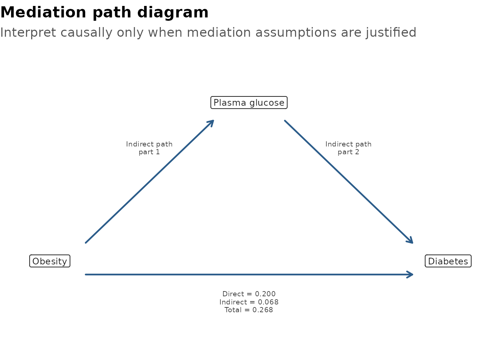
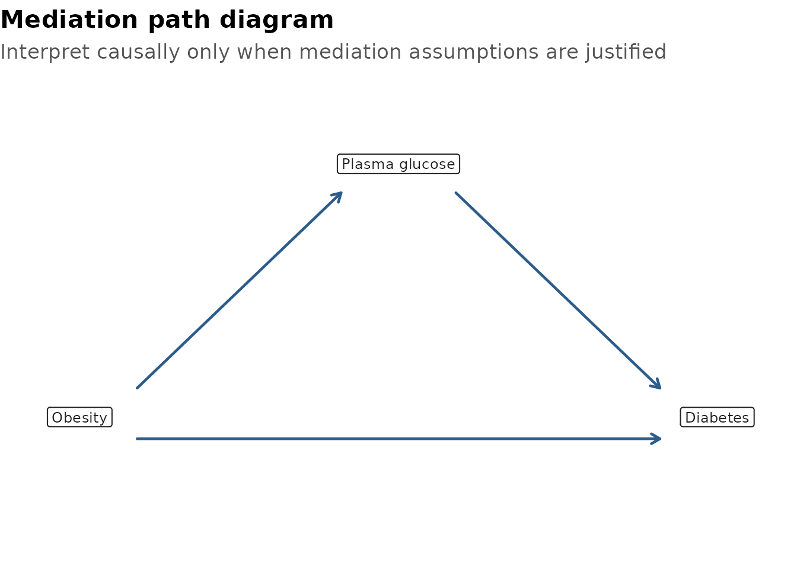
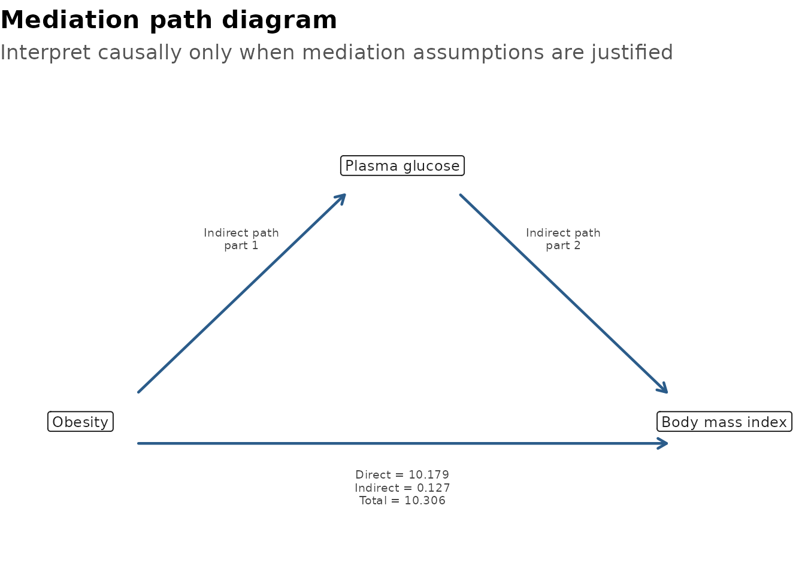

# Causal Mediation Analysis

Mediation analysis asks whether part of an exposure-outcome association
may pass through an intermediate variable. In health research, that
question is usually interesting only after the clinical story, temporal
order, and likely confounding structure have already been considered.

`gtregression` provides a compact workflow for:

- fitting the mediator and outcome models;
- estimating total, direct, indirect, and proportion mediated effects;
- displaying a publication-style table;
- drawing a simple mediation path diagram.

The output is deliberately transparent. It is a model-based aid to
interpretation, not proof of causality by itself.

## Example Question

This article uses `data_diabetes_mediation`, a teaching dataset based on
a diabetes risk profile. The example question is:

> Does plasma glucose explain part of the association between obesity
> and diabetes?

``` r

library(gtregression)
library(dplyr)

data("data_diabetes_mediation", package = "gtregression")

glimpse(data_diabetes_mediation)
```

    ## Rows: 724
    ## Columns: 8
    ## $ diabetes          <fct> Yes, No, Yes, No, Yes, No, Yes, Yes, No, Yes, No, Ye…
    ## $ obesity           <fct> Yes, No, No, No, Yes, No, Yes, Yes, Yes, Yes, No, Ye…
    ## $ glucose           <dbl> 148, 85, 183, 89, 137, 116, 78, 197, 110, 168, 139, …
    ## $ bmi               <dbl> 33.6, 26.6, 23.3, 28.1, 43.1, 25.6, 31.0, 30.5, 37.6…
    ## $ age               <dbl> 50, 31, 32, 21, 33, 30, 26, 53, 30, 34, 57, 59, 51, …
    ## $ blood_pressure    <dbl> 72, 66, 64, 66, 40, 74, 50, 70, 92, 74, 80, 60, 72, …
    ## $ pregnancies       <dbl> 6, 1, 8, 1, 0, 5, 3, 2, 4, 10, 10, 1, 5, 0, 7, 1, 1,…
    ## $ diabetes_pedigree <dbl> 0.627, 0.351, 0.672, 0.167, 2.288, 0.201, 0.248, 0.1…

## Logistic Outcome

For a binary outcome, use `outcome_approach = logit`. The effects are
reported as predicted probability differences, which are often easier to
explain than odds ratios in a mediation table.

For final analyses, use a larger number of bootstrap simulations such as
`sims = 500` or `sims = 1000`. The article uses a smaller value to keep
the example quick to run.

``` r

diabetes_med <- mediation_analysis(
  data = data_diabetes_mediation,
  exposure = obesity,
  mediator = glucose,
  outcome = diabetes,
  covariates = c(age, blood_pressure, pregnancies, diabetes_pedigree),
  outcome_approach = logit,
  sims = 100,
  seed = 123
)

diabetes_med$table
```

| Effect | Estimate | 95% CI | p-value | Interpretation |
|----|----|----|----|----|
| Total effect | 0.268 | 0.188 to 0.341 | \<0.001 | Overall exposure-outcome association |
| Direct effect | 0.200 | 0.131 to 0.266 | \<0.001 | Association not through the mediator |
| Indirect effect | 0.068 | 0.037 to 0.106 | \<0.001 | Association through the mediator |
| Proportion mediated | 0.255 | 0.137 to 0.392 | \<0.001 | Share of total effect through the mediator |
| Effects are predicted probability differences from logistic outcome models. |  |  |  |  |
| Comparison: Obesity = Yes vs No; mediator = Plasma glucose; outcome = Diabetes. Bootstrap replicates = 100. |  |  |  |  |
| Adjusted for Age, Diastolic blood pressure, Number of pregnancies, Diabetes pedigree function. |  |  |  |  |
| Causal interpretation requires DAG-supported no-unmeasured-confounding and correct temporal-order assumptions. |  |  |  |  |

The returned object keeps the table body, fitted models, bootstrap
draws, and exposure comparison values available for checking.

``` r

diabetes_med$table_body
```

    ##                effect              Effect   estimate  conf.low conf.high
    ## total           total        Total effect 0.26811037 0.1882239 0.3413496
    ## direct         direct       Direct effect 0.19978127 0.1306665 0.2664345
    ## indirect     indirect     Indirect effect 0.06832911 0.0368084 0.1057748
    ## proportion proportion Proportion mediated 0.25485440 0.1365921 0.3920930
    ##            p.value                             Interpretation
    ## total            0       Overall exposure-outcome association
    ## direct           0       Association not through the mediator
    ## indirect         0           Association through the mediator
    ## proportion       0 Share of total effect through the mediator

``` r

diabetes_med$values
```

    ## $reference_value
    ## [1] "No"
    ## 
    ## $exposure_value
    ## [1] "Yes"

``` r

diabetes_med$models$mediator
```

    ## 
    ## Call:
    ## stats::lm(formula = .mediation_formula(mediator, c(exposure, 
    ##     covariates)), data = df)
    ## 
    ## Coefficients:
    ##       (Intercept)         obesityYes                age     blood_pressure  
    ##           69.9217             9.4519             0.5894             0.3050  
    ##       pregnancies  diabetes_pedigree  
    ##           -0.2092            10.7711

``` r

diabetes_med$models$outcome
```

    ## 
    ## Call:  stats::glm(formula = f, family = stats::binomial(), data = df)
    ## 
    ## Coefficients:
    ##       (Intercept)         obesityYes            glucose                age  
    ##         -7.220509           1.241446           0.035385           0.014817  
    ##    blood_pressure        pregnancies  diabetes_pedigree  
    ##         -0.002162           0.106363           1.028275  
    ## 
    ## Degrees of Freedom: 723 Total (i.e. Null);  717 Residual
    ## Null Deviance:       931.9 
    ## Residual Deviance: 674.4     AIC: 688.4

``` r

head(diabetes_med$boot)
```

    ##       total    direct   indirect proportion
    ## 1 0.3002124 0.2192066 0.08100578  0.2698283
    ## 2 0.2902380 0.2287934 0.06144464  0.2117043
    ## 3 0.3568782 0.2291300 0.12774815  0.3579601
    ## 4 0.2234355 0.1744756 0.04895991  0.2191232
    ## 5 0.2609932 0.2003587 0.06063449  0.2323221
    ## 6 0.3104067 0.2250761 0.08533069  0.2748996

## Path Diagram

[`plot_mediation()`](https://thinkdenominator.github.io/gtregression/reference/plot_mediation.md)
draws the exposure, mediator, outcome, and the direct and indirect
paths.

``` r

plot_mediation(diabetes_med)
```



If the figure is being used only to explain the causal structure, hide
the estimates.

``` r

plot_mediation(diabetes_med, show_estimates = FALSE)
```



## Quoted Names

Quoted column names and stored character vectors work too. This is
useful inside scripts, functions, and Shiny-style workflows.

``` r

exposure_var <- "obesity"
mediator_var <- "glucose"
outcome_var <- "diabetes"
covariate_vars <- c(
  "age", "blood_pressure", "pregnancies", "diabetes_pedigree"
)

med_quoted <- mediation_analysis(
  data = data_diabetes_mediation,
  exposure = exposure_var,
  mediator = mediator_var,
  outcome = outcome_var,
  covariates = covariate_vars,
  outcome_approach = "logit",
  sims = 100,
  seed = 456
)

med_quoted$table
```

| Effect | Estimate | 95% CI | p-value | Interpretation |
|----|----|----|----|----|
| Total effect | 0.268 | 0.191 to 0.337 | \<0.001 | Overall exposure-outcome association |
| Direct effect | 0.200 | 0.136 to 0.268 | \<0.001 | Association not through the mediator |
| Indirect effect | 0.068 | 0.035 to 0.097 | \<0.001 | Association through the mediator |
| Proportion mediated | 0.255 | 0.131 to 0.379 | \<0.001 | Share of total effect through the mediator |
| Effects are predicted probability differences from logistic outcome models. |  |  |  |  |
| Comparison: Obesity = Yes vs No; mediator = Plasma glucose; outcome = Diabetes. Bootstrap replicates = 100. |  |  |  |  |
| Adjusted for Age, Diastolic blood pressure, Number of pregnancies, Diabetes pedigree function. |  |  |  |  |
| Causal interpretation requires DAG-supported no-unmeasured-confounding and correct temporal-order assumptions. |  |  |  |  |

## Linear Outcome

For a continuous outcome, use `outcome_approach = linear`. In this
example, the outcome is body mass index, so the effects are reported as
mean differences.

``` r

med_linear <- mediation_analysis(
  data = data_diabetes_mediation,
  exposure = obesity,
  mediator = glucose,
  outcome = bmi,
  covariates = c(age, blood_pressure, pregnancies, diabetes_pedigree),
  outcome_approach = linear,
  sims = 100,
  seed = 789
)

med_linear$table
```

| Effect | Estimate | 95% CI | p-value | Interpretation |
|----|----|----|----|----|
| Total effect | 10.306 | 9.844 to 10.864 | \<0.001 | Overall exposure-outcome association |
| Direct effect | 10.179 | 9.716 to 10.755 | \<0.001 | Association not through the mediator |
| Indirect effect | 0.127 | 0.027 to 0.241 | \<0.001 | Association through the mediator |
| Proportion mediated | 0.012 | 0.003 to 0.023 | \<0.001 | Share of total effect through the mediator |
| Effects are mean differences from linear outcome models. |  |  |  |  |
| Comparison: Obesity = Yes vs No; mediator = Plasma glucose; outcome = Body mass index. Bootstrap replicates = 100. |  |  |  |  |
| Adjusted for Age, Diastolic blood pressure, Number of pregnancies, Diabetes pedigree function. |  |  |  |  |
| Causal interpretation requires DAG-supported no-unmeasured-confounding and correct temporal-order assumptions. |  |  |  |  |

``` r

plot_mediation(med_linear)
```



## How To Report

A compact reporting sentence might look like this:

> In this teaching analysis, plasma glucose explained part of the
> model-based obesity-diabetes association. Effects were estimated on
> the predicted probability difference scale using logistic outcome
> models and bootstrap confidence intervals.

The table footnote records the exposure comparison, mediator, outcome,
bootstrap replicates, and adjustment variables so readers can see what
was estimated.

## What Not To Claim

Mediation estimates should not be treated as automatic causal proof. A
cautious analysis should consider:

- whether the exposure clearly precedes the mediator;
- whether the mediator clearly precedes the outcome;
- whether exposure-mediator, mediator-outcome, and exposure-outcome
  confounding have been handled;
- whether post-exposure confounders are present;
- whether the model forms are plausible;
- whether a DAG or subject-matter argument supports the causal
  interpretation.

Use the table and plot to support interpretation after that thinking has
been done.
