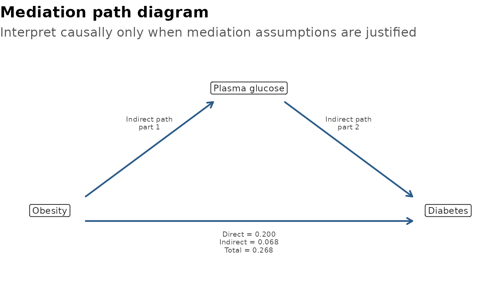

# Confounding and Interaction

Confounding asks whether adjustment changes the exposure effect.
Interaction asks whether the exposure effect differs across another
variable.

These checks are screening aids for viewing and organising results. Use
DAGs, subject-matter knowledge, and study design to decide which
variables are confounders or effect modifiers. Automated
change-in-estimate and interaction checks should not be used as the sole
basis for model adjustment.

## Which Function Should I Use?

| Question | Use | Why |
|----|----|----|
| Could these candidate variables be confounders or effect modifiers? | [`identify_confounder()`](https://gtregression.thinkdenominator.com/reference/identify_confounder.md) | Screens crude, adjusted, Mantel-Haenszel, and interaction signals together. |
| Does this planned interaction term improve the model? | [`interaction_models()`](https://gtregression.thinkdenominator.com/reference/interaction_models.md) | Compares models with and without `exposure:effect_modifier` using LRT or Wald tests. |
| Could part of an exposure-outcome association operate through a mediator? | [`mediation_analysis()`](https://gtregression.thinkdenominator.com/reference/mediation_analysis.md) | Estimates direct, indirect, total, and proportion mediated effects with explicit causal caveats. |
| Do I need a Mantel-Haenszel estimate? | `identify_confounder(method = "mh")` or `identify_confounder(method = "both")` | MH is a stratified pooled estimate for eligible binary/categorical settings, not a formal interaction-term test. |

A practical workflow is:

1.  Use DAGs, prior literature, and study design to list important
    variables.
2.  Use
    [`identify_confounder()`](https://gtregression.thinkdenominator.com/reference/identify_confounder.md)
    to organise screening evidence for candidate confounders or effect
    modifiers.
3.  Use
    [`interaction_models()`](https://gtregression.thinkdenominator.com/reference/interaction_models.md)
    when you have a planned interaction hypothesis.
4.  Use
    [`mediation_analysis()`](https://gtregression.thinkdenominator.com/reference/mediation_analysis.md)
    when the mediator is part of a planned causal question and the
    temporal order is defensible.
5.  If interaction is important, consider stratified reporting with
    [`stratified_uni_reg()`](https://gtregression.thinkdenominator.com/reference/stratified_uni_reg.md)
    or
    [`stratified_multi_reg()`](https://gtregression.thinkdenominator.com/reference/stratified_multi_reg.md).

``` r

library(gtregression)
library(dplyr)

data("data_birthwt", package = "gtregression")

birthwt_data <- data_birthwt |>
  mutate(
    race = factor(race, levels = c(1, 2, 3),
                  labels = c("White", "Black", "Other")),
    smoke = factor(smoke, levels = c(0, 1), labels = c("No", "Yes")),
    ht = factor(ht, levels = c(0, 1), labels = c("No", "Yes")),
    low = factor(low, levels = c(0, 1), labels = c("Normal BW", "Low BW"))
  )

attr(birthwt_data$race, "label") <- "Maternal race"
attr(birthwt_data$smoke, "label") <- "Smoking during pregnancy"
attr(birthwt_data$ht, "label") <- "Hypertension"
```

## Identify Confounders

Use `method = "change"` for the model-based change-in-estimate method.
Use `method = "mh"` or `method = "both"` when Mantel-Haenszel is
appropriate. The output is intentionally tidy and intended for viewing,
not as a final publication table.

``` r

confounder_check <- identify_confounder(
  data = birthwt_data,
  outcome = low,
  exposure = smoke,
  potential_confounder = c("race", "ht"),
  approach = logit,
  method = both,
  format = gt
)

confounder_check$table
```

| Exposure | Candidate | Crude estimate | Adjusted estimate | MH estimate | % change model | % change MH | Confounder? | Interaction p | Effect modifier? | Decision | Recommendation |
|----|----|----|----|----|----|----|----|----|----|----|----|
| smoke | race | 2.022 | 3.053 | 3.086 | 50.98 | 52.64 | Yes | 0.206 | No | Confounder | Adjust for race. |
| smoke | ht | 2.022 | 2.038 | 2.032 | 0.78 | 0.51 | No | 0.607 | No | No evidence | No clear statistical evidence to include ht as a confounder. |
| Screening aid only; use DAGs, subject-matter knowledge, and study design to decide confounding and effect modification. |  |  |  |  |  |  |  |  |  |  |  |

The underlying summary remains available for inspection or further
filtering.

``` r

confounder_check$summary
```

    ## # A tibble: 2 × 13
    ##   exposure candidate crude_est adjusted_est mh_est percent_change
    ##   <chr>    <chr>         <dbl>        <dbl>  <dbl>          <dbl>
    ## 1 smoke    race           2.02         3.05   3.09          51.0 
    ## 2 smoke    ht             2.02         2.04   2.03           0.78
    ## # ℹ 7 more variables: percent_change_model <dbl>, percent_change_mh <dbl>,
    ## #   is_confounder <lgl>, interaction_p <dbl>, is_effect_modifier <lgl>,
    ## #   decision <chr>, recommendation <chr>

## Mantel-Haenszel Estimate

Mantel-Haenszel is useful when the question is whether a stratified
pooled estimate differs meaningfully from the crude estimate. It is
available for eligible binary/categorical settings. It is not the same
as fitting an interaction term.

``` r

identify_confounder(
  data = birthwt_data,
  outcome = low,
  exposure = smoke,
  potential_confounder = race,
  approach = logit,
  method = mh,
  format = flextable
)$table
```

| Exposure | Candidate | Crude estimate | Adjusted estimate | MH estimate | % change model | % change MH | Confounder? | Interaction p | Effect modifier? | Decision | Recommendation |
|----|----|----|----|----|----|----|----|----|----|----|----|
| smoke | race | 2.022 | 3.053 | 3.086 | 50.98 | 52.64 | Yes | 0.206 | No | Confounder | Adjust for race. |
| Screening aid only; use DAGs, subject-matter knowledge, and study design to decide confounding and effect modification. |  |  |  |  |  |  |  |  |  |  |  |

## Test Interaction

[`interaction_models()`](https://gtregression.thinkdenominator.com/reference/interaction_models.md)
compares models with and without the interaction term. It is
deliberately model-based and uses `LRT` or `Wald`, not Mantel-Haenszel.
Use it when the interaction term is planned or supported by clinical,
causal, or subject-matter reasoning.

``` r

interaction_check <- interaction_models(
  data = birthwt_data,
  outcome = low,
  exposure = smoke,
  effect_modifier = race,
  covariates = c("age", "lwt"),
  approach = logit,
  test = LRT,
  format = gt
)

interaction_check$table
```

| Interaction screening |  |  |  |  |  |  |  |  |  |
|----|----|----|----|----|----|----|----|----|----|
| Outcome | Exposure | Effect modifier | Approach | Test | p-value | Alpha | Interaction? | Decision | Interpretation |
| low | smoke | race | logit | Likelihood Ratio Test | 0.319 | 0.050 | No | No interaction | No statistical evidence of interaction between smoke and race at alpha = 0.05. |
| Screening aid only; interaction decisions should be interpreted with subject-matter knowledge, study design, and stratum-specific estimates. |  |  |  |  |  |  |  |  |  |

## Survival Confounding and Interaction

The same grammar works for survival models. For `cox` and
`surv`/`survreg`, use `time` and `event` instead of `outcome`. Cox
models report hazard-ratio style estimates; parametric survival models
report time-ratio style estimates. Mantel-Haenszel screening is for
binary outcome settings, so survival examples use model-based
change-in-estimate and interaction checks.

``` r

lung_data <- data_lungcancer |>
  dplyr::mutate(
    trt = factor(trt, levels = c(1, 2),
                 labels = c("Standard treatment", "Test treatment")),
    prior = factor(prior, levels = c(0, 10), labels = c("No", "Yes"))
  )

survival_confounder <- identify_confounder(
  data = lung_data,
  time = time,
  event = status,
  exposure = trt,
  potential_confounder = prior,
  approach = cox,
  method = change,
  format = gt
)

survival_confounder$table
```

| Exposure | Candidate | Crude estimate | Adjusted estimate | MH estimate | % change model | % change MH | Confounder? | Interaction p | Effect modifier? | Decision | Recommendation |
|----|----|----|----|----|----|----|----|----|----|----|----|
| trt | prior | 1.018 | 1.026 |  | 0.84 |  | No |  | No | No evidence | No clear statistical evidence to include prior as a confounder. |
| Screening aid only; use DAGs, subject-matter knowledge, and study design to decide confounding and effect modification. |  |  |  |  |  |  |  |  |  |  |  |

``` r

survival_interaction <- interaction_models(
  data = lung_data,
  time = time,
  event = status,
  exposure = trt,
  effect_modifier = prior,
  covariates = c(age, karno),
  approach = cox,
  test = LRT,
  format = gt
)

survival_interaction$table
```

| Interaction screening |  |  |  |  |  |  |  |  |  |
|----|----|----|----|----|----|----|----|----|----|
| Outcome | Exposure | Effect modifier | Approach | Test | p-value | Alpha | Interaction? | Decision | Interpretation |
| time/status | trt | prior | cox | Likelihood Ratio Test | 0.068 | 0.050 | No | No interaction | No statistical evidence of interaction between trt and prior at alpha = 0.05. |
| Screening aid only; interaction decisions should be interpreted with subject-matter knowledge, study design, and stratum-specific estimates. |  |  |  |  |  |  |  |  |  |

## Causal Mediation

[`mediation_analysis()`](https://gtregression.thinkdenominator.com/reference/mediation_analysis.md)
asks whether part of an exposure-outcome association may operate through
a mediator. In this example, obesity is the exposure, plasma glucose is
the mediator, and diabetes is the outcome. The question is not only “is
obesity associated with diabetes?”, but also “how much of that
association may operate through plasma glucose?”.

The default output is a publication-ready flextable. The table reports:

- **Total effect**: the overall exposure-outcome association.
- **Direct effect**: the part not operating through the mediator.
- **Indirect effect**: the part operating through the mediator.
- **Proportion mediated**: the share of the total effect attributed to
  the indirect pathway.

For logistic outcomes, effects are reported as predicted probability
differences, not odds ratios. For example, an estimate of `0.068` means
about a 6.8 percentage-point difference on the predicted probability
scale.

Treat mediation output as causal only when the usual mediation
assumptions are supported by study design, DAGs, temporality, and
subject-matter knowledge. In particular, there should be no unmeasured
exposure-outcome, exposure-mediator, or mediator-outcome confounding,
and the mediator should occur before the outcome.

``` r

data("data_diabetes_mediation", package = "gtregression")

diabetes_med <- mediation_analysis(
  data = data_diabetes_mediation,
  exposure = obesity,
  mediator = glucose,
  outcome = diabetes,
  covariates = c(age, blood_pressure, pregnancies, diabetes_pedigree),
  outcome_approach = logit,
  sims = 100,
  seed = 123
)

diabetes_med$table
```

| Effect | Estimate | 95% CI | p-value | Interpretation |
|----|----|----|----|----|
| Total effect | 0.268 | 0.188 to 0.341 | \<0.001 | Overall exposure-outcome association |
| Direct effect | 0.200 | 0.131 to 0.266 | \<0.001 | Association not through the mediator |
| Indirect effect | 0.068 | 0.037 to 0.106 | \<0.001 | Association through the mediator |
| Proportion mediated | 0.255 | 0.137 to 0.392 | \<0.001 | Share of total effect through the mediator |
| Effects are predicted probability differences from logistic outcome models. |  |  |  |  |
| Comparison: Obesity = Yes vs No; mediator = Plasma glucose; outcome = Diabetes. Bootstrap replicates = 100. |  |  |  |  |
| Adjusted for Age, Diastolic blood pressure, Number of pregnancies, Diabetes pedigree function. |  |  |  |  |
| Causal interpretation requires DAG-supported no-unmeasured-confounding and correct temporal-order assumptions. |  |  |  |  |

The underlying values remain available for audit, reporting, or custom
formatting.

``` r

diabetes_med$table_body
```

    ##                effect              Effect   estimate  conf.low conf.high
    ## total           total        Total effect 0.26811037 0.1882239 0.3413496
    ## direct         direct       Direct effect 0.19978127 0.1306665 0.2664345
    ## indirect     indirect     Indirect effect 0.06832911 0.0368084 0.1057748
    ## proportion proportion Proportion mediated 0.25485440 0.1365921 0.3920930
    ##            p.value                             Interpretation
    ## total            0       Overall exposure-outcome association
    ## direct           0       Association not through the mediator
    ## indirect         0           Association through the mediator
    ## proportion       0 Share of total effect through the mediator

Use `format = gt` when preparing HTML-first outputs such as websites or
teaching pages.

``` r

med_gt <- mediation_analysis(
  data = data_diabetes_mediation,
  exposure = obesity,
  mediator = glucose,
  outcome = diabetes,
  covariates = c(age, blood_pressure, pregnancies, diabetes_pedigree),
  outcome_approach = logit,
  format = gt,
  sims = 100,
  seed = 123
)

med_gt$table
```

| Effect | Estimate | 95% CI | p-value | Interpretation |
|----|----|----|----|----|
| Total effect | 0.268 | 0.188 to 0.341 | \<0.001 | Overall exposure-outcome association |
| Direct effect | 0.200 | 0.131 to 0.266 | \<0.001 | Association not through the mediator |
| Indirect effect | 0.068 | 0.037 to 0.106 | \<0.001 | Association through the mediator |
| Proportion mediated | 0.255 | 0.137 to 0.392 | \<0.001 | Share of total effect through the mediator |
| Effects are predicted probability differences from logistic outcome models. |  |  |  |  |
| Comparison: Obesity = Yes vs No; mediator = Plasma glucose; outcome = Diabetes. Bootstrap replicates = 100. |  |  |  |  |
| Adjusted for Age, Diastolic blood pressure, Number of pregnancies, Diabetes pedigree function. |  |  |  |  |
| Causal interpretation requires DAG-supported no-unmeasured-confounding and correct temporal-order assumptions. |  |  |  |  |

[`plot_mediation()`](https://gtregression.thinkdenominator.com/reference/plot_mediation.md)
draws the same planned causal structure as a path diagram. It is useful
for teaching, presentations, or checking that the exposure, mediator,
and outcome have been specified as intended.

``` r

plot_mediation(diabetes_med)
```



If the estimates make the plot too busy, hide them and use the diagram
only to show the assumed path structure.

``` r

plot_mediation(diabetes_med, show_estimates = FALSE)
```


## Overlap and Difference

| Topic | [`identify_confounder()`](https://gtregression.thinkdenominator.com/reference/identify_confounder.md) | [`interaction_models()`](https://gtregression.thinkdenominator.com/reference/interaction_models.md) |
|----|----|----|
| Main purpose | Organises candidate confounder and effect-modifier screening signals. | Tests a planned exposure-by-modifier term. |
| Typical input | Exposure plus one or more candidate variables. | One exposure and one effect modifier. |
| Confounding | Crude vs adjusted change-in-estimate; optional Mantel-Haenszel comparison. | Not designed for confounder selection. |
| Effect modification | Screening signal from stratum-specific estimates and interaction p-value. | Model comparison using LRT or Wald test. |
| Best use | Early review of candidate variables, with DAGs and judgement. | Focused test of a clinically or biologically plausible interaction. |
| Output status | Viewing aid, not publication-ready evidence by itself. | Viewing aid; report with stratum-specific estimates when relevant. |

[`mediation_analysis()`](https://gtregression.thinkdenominator.com/reference/mediation_analysis.md)
is different from both functions. It decomposes one planned
exposure-outcome relationship into direct and mediator-related
components; it does not select confounders or test whether effects
differ across strata.

## What To Inspect

- [`identify_confounder()`](https://gtregression.thinkdenominator.com/reference/identify_confounder.md):
  `$summary`, `$table`, `$details`, `$mh_estimate`, `$mh_status`,
  `$decision`, and `$recommendation`.
- [`interaction_models()`](https://gtregression.thinkdenominator.com/reference/interaction_models.md):
  `$summary`, `$table`, `$p_value`, `$decision`, and fitted model
  objects.
- [`mediation_analysis()`](https://gtregression.thinkdenominator.com/reference/mediation_analysis.md):
  `$table`, `$table_body`, `$models`, `$boot`, `$values`,
  `$variable_labels`, and `$complete_data`.
- Use subject-matter knowledge with these outputs. The functions support
  interpretation; they do not replace the study design.
