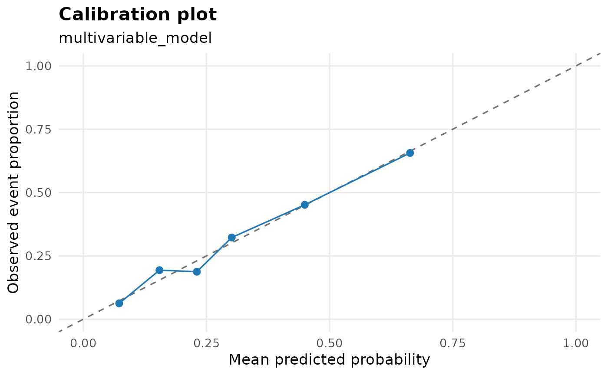
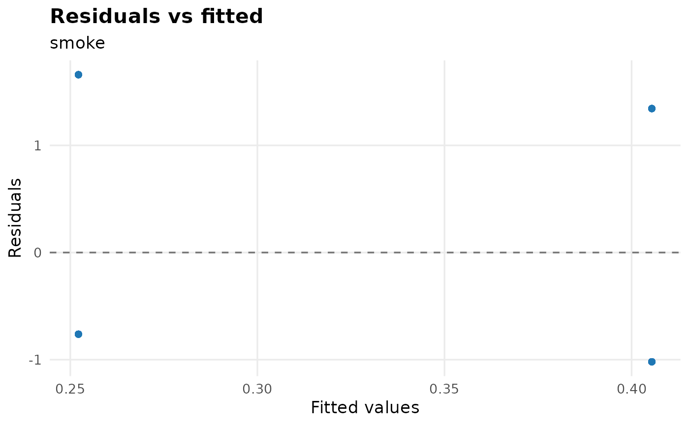
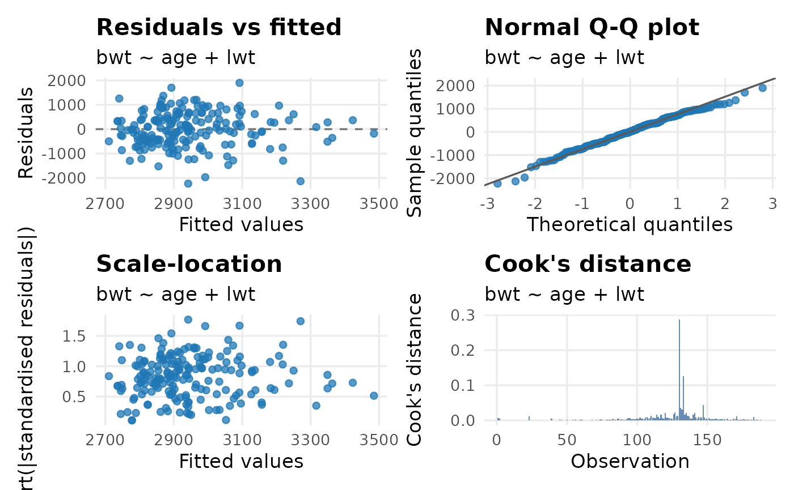

# Diagnostics and Model Selection

Before the final table goes into a manuscript, check the model. These
helpers keep diagnostics close to the regression workflow. They are
screening aids: interpret them with the study design, clinical or
subject-matter judgement, and the diagnostics from the fitted model.

``` r

library(gtregression)
library(dplyr)

data("data_birthwt", package = "gtregression")

birthwt_data <- data_birthwt |>
  mutate(
    race = factor(race, levels = c(1, 2, 3),
                  labels = c("White", "Black", "Other")),
    smoke = factor(smoke, levels = c(0, 1), labels = c("No", "Yes")),
    ht = factor(ht, levels = c(0, 1), labels = c("No", "Yes")),
    ui = factor(ui, levels = c(0, 1), labels = c("No", "Yes")),
    low = factor(low, levels = c(0, 1), labels = c("Normal BW", "Low BW")),
    ptl_cat = factor(ifelse(ptl > 0, "Yes", "No"), levels = c("No", "Yes"))
  )

exposures <- c("age", "lwt", "race", "smoke", "ht", "ui", "ptl_cat")
```

## Convergence Screening

Use
[`check_convergence()`](https://thinkdenominator.github.io/gtregression/reference/check_convergence.md)
before interpreting model estimates, especially for log-binomial and
small or sparse binary-outcome models. A non-converged model is a
fitting warning, not a finding.

``` r

check_convergence(
  data = birthwt_data,
  exposures = exposures,
  outcome = low,
  approach = logit,
  multivariate = TRUE,
  format = gt
)
```

| Convergence check |  |  |  |
|----|----|----|----|
| Exposure | Model | Converged | Max fitted value |
| age + lwt + race + smoke + ht + ui + ptl_cat | logit | Yes | 0.880 |
| Screening aid only; inspect non-convergence, impossible fitted values, and model specification before interpreting estimates. |  |  |  |

For risk-ratio workflows, this same check helps users decide whether a
log-binomial model fitted cleanly or whether a robust Poisson approach
may be a more practical sensitivity analysis.

``` r

check_convergence(
  data = birthwt_data,
  exposures = c("smoke", "ht", "ui", "ptl_cat"),
  outcome = low,
  approach = logbinomial,
  multivariate = TRUE,
  format = flextable
)
```

| Exposure | Model | Converged | Max fitted value |
|----|----|----|----|
| smoke + ht + ui + ptl_cat | logbinomial | No |  |
| Screening aid only; inspect non-convergence, impossible fitted values, and model specification before interpreting estimates. |  |  |  |

Convergence check {.table .cl-f95fc2ba quarto-disable-processing="true"}

## Collinearity Screening

[`check_collinearity()`](https://thinkdenominator.github.io/gtregression/reference/check_collinearity.md)
reports VIF-style diagnostics for multivariable models. High VIF values
are prompts to inspect coding, overlap between predictors, and the
scientific purpose of the model.

``` r

birthwt_multi <- multi_reg(
  data = birthwt_data,
  outcome = low,
  exposures = exposures,
  approach = logit
)

check_collinearity(birthwt_multi, format = gt)
```

| Collinearity check |  |  |
|----|----|----|
| Variable | VIF | Interpretation |
| age | 1.04 | No collinearity |
| lwt | 1.14 | No collinearity |
| race | 1.11 | No collinearity |
| smoke | 1.16 | No collinearity |
| ht | 1.08 | No collinearity |
| ui | 1.02 | No collinearity |
| ptl_cat | 1.05 | No collinearity |
| Screening aid only; interpret VIF with model purpose, coding choices, sample size, and subject-matter knowledge. |  |  |

Adjusted-mode
[`multi_reg()`](https://thinkdenominator.github.io/gtregression/reference/multi_reg.md)
objects contain one model per exposure. The collinearity output keeps
that list structure so each model can be inspected separately.

``` r

birthwt_adjusted <- multi_reg(
  data = birthwt_data,
  outcome = low,
  exposures = c("smoke", "ht", "ui", "ptl_cat"),
  adjust_for = c("age", "lwt", "race"),
  approach = logit
)

check_collinearity(birthwt_adjusted, format = tibble)
```

    ## $smoke
    ## # A tibble: 4 × 3
    ##   Variable   VIF Interpretation 
    ##   <chr>    <dbl> <chr>          
    ## 1 smoke     1.14 No collinearity
    ## 2 age       1.03 No collinearity
    ## 3 lwt       1.06 No collinearity
    ## 4 race      1.1  No collinearity
    ## 
    ## $ht
    ## # A tibble: 4 × 3
    ##   Variable   VIF Interpretation 
    ##   <chr>    <dbl> <chr>          
    ## 1 ht        1.07 No collinearity
    ## 2 age       1.02 No collinearity
    ## 3 lwt       1.14 No collinearity
    ## 4 race      1.03 No collinearity
    ## 
    ## $ui
    ## # A tibble: 4 × 3
    ##   Variable   VIF Interpretation 
    ##   <chr>    <dbl> <chr>          
    ## 1 ui        1.01 No collinearity
    ## 2 age       1.03 No collinearity
    ## 3 lwt       1.07 No collinearity
    ## 4 race      1.04 No collinearity
    ## 
    ## $ptl_cat
    ## # A tibble: 4 × 3
    ##   Variable   VIF Interpretation 
    ##   <chr>    <dbl> <chr>          
    ## 1 ptl_cat   1.03 No collinearity
    ## 2 age       1.05 No collinearity
    ## 3 lwt       1.07 No collinearity
    ## 4 race      1.04 No collinearity

## Model Fit Plots

[`plot_model_fit()`](https://thinkdenominator.github.io/gtregression/reference/plot_model_fit.md)
turns fitted models into quick diagnostic plots. It accepts raw
[`lm()`](https://rdrr.io/r/stats/lm.html) and
[`glm()`](https://rdrr.io/r/stats/glm.html) objects, and it also works
with models saved inside
[`uni_reg()`](https://thinkdenominator.github.io/gtregression/reference/uni_reg.md)
and
[`multi_reg()`](https://thinkdenominator.github.io/gtregression/reference/multi_reg.md)
results.

For logistic regression, the calibration plot compares predicted
probabilities with observed event proportions. Points close to the
diagonal line suggest that the model predictions are reasonably aligned
with the observed data. Calibration is usually most useful for
multivariable models because predicted probabilities vary across many
people.

``` r

plot_model_fit(
  birthwt_multi,
  type = calibration,
  bins = 6
)
```



When a
[`uni_reg()`](https://thinkdenominator.github.io/gtregression/reference/uni_reg.md)
object contains several models, use `model_name` to choose the exposure
you want to inspect. For a simple binary exposure, calibration may only
show two points because the model has only two fitted probabilities; in
that situation, residual and influence plots are usually more useful.

``` r

birthwt_uni <- uni_reg(
  data = birthwt_data,
  outcome = low,
  exposures = c("age", "lwt", "smoke"),
  approach = logit
)

plot_model_fit(
  birthwt_uni,
  model_name = smoke,
  type = residual
)
```



For logistic models, residual plots often form two visible bands. That
is a normal consequence of a 0/1 outcome and should be interpreted as a
screening plot rather than a linear-model residual plot.

For linear regression, `type = all` shows the classic residual, Q-Q,
scale-location, and Cook’s distance views.

``` r

fit_lm <- lm(bwt ~ age + lwt, data = birthwt_data)
plot_model_fit(fit_lm)
```



## Proportional Hazards Screening

For Cox models, use
[`check_ph()`](https://thinkdenominator.github.io/gtregression/reference/check_ph.md)
before treating hazard ratios as final. It reports Schoenfeld residual
tests from
[`survival::cox.zph()`](https://rdrr.io/pkg/survival/man/cox.zph.html),
including a global test. Small p-values suggest possible
non-proportional hazards and should be reviewed with plots, follow-up
pattern, and clinical judgement.

``` r

data("data_lungcancer", package = "gtregression")

lung_data <- data_lungcancer |>
  mutate(
    trt = factor(trt, levels = c(1, 2),
                 labels = c("Standard treatment", "Test treatment")),
    prior = factor(prior, levels = c(0, 10), labels = c("No", "Yes")),
    celltype = factor(
      celltype,
      levels = c("squamous", "smallcell", "adeno", "large"),
      labels = c("Squamous", "Small cell", "Adenocarcinoma", "Large cell")
    )
  )

cox_fit <- cox_reg(
  data = lung_data,
  time = time,
  event = status,
  exposures = c(trt, celltype, prior),
  adjust_for = c(age, karno)
)
```

``` r

check_ph(cox_fit, format = gt)
```

| Proportional hazards check |  |  |  |  |  |  |
|----|----|----|----|----|----|----|
| Model | Term | Test | Chi-square | df | p-value | Interpretation |
| trt | trt | Term | 0.28 | 1 | 0.594 | No evidence of PH violation |
| trt | age | Term | 2.10 | 1 | 0.147 | No evidence of PH violation |
| trt | karno | Term | 12.00 | 1 | \<0.001 | Possible PH violation |
| trt | GLOBAL | Global | 19.10 | 3 | \<0.001 | Possible PH violation |
| celltype | celltype | Term | 14.15 | 3 | 0.003 | Possible PH violation |
| celltype | age | Term | 1.99 | 1 | 0.158 | No evidence of PH violation |
| celltype | karno | Term | 14.77 | 1 | \<0.001 | Possible PH violation |
| celltype | GLOBAL | Global | 30.18 | 5 | \<0.001 | Possible PH violation |
| prior | prior | Term | 1.87 | 1 | 0.171 | No evidence of PH violation |
| prior | age | Term | 2.18 | 1 | 0.140 | No evidence of PH violation |
| prior | karno | Term | 13.31 | 1 | \<0.001 | Possible PH violation |
| prior | GLOBAL | Global | 22.29 | 3 | \<0.001 | Possible PH violation |
| Screening aid only. Small p-values suggest possible non-proportional hazards; interpret with Schoenfeld residual plots, follow-up pattern, clinical context, and model purpose. alpha = 0.05; transform = km. |  |  |  |  |  |  |

Use `format = tibble` when you want to inspect or filter the diagnostic
results.

``` r

check_ph(cox_fit, transform = rank, format = tibble)
```

    ## # A tibble: 12 × 7
    ##    Model    Term     Test   Chi.square    df   p.value Interpretation           
    ##    <chr>    <chr>    <chr>       <dbl> <dbl>     <dbl> <chr>                    
    ##  1 trt      trt      Term        0.278     1 0.598     No evidence of PH violat…
    ##  2 trt      age      Term        2.04      1 0.153     No evidence of PH violat…
    ##  3 trt      karno    Term       12.6       1 0.000377  Possible PH violation    
    ##  4 trt      GLOBAL   Global     19.7       3 0.000191  Possible PH violation    
    ##  5 celltype celltype Term       14.3       3 0.00249   Possible PH violation    
    ##  6 celltype age      Term        1.93      1 0.164     No evidence of PH violat…
    ##  7 celltype karno    Term       15.4       1 0.0000877 Possible PH violation    
    ##  8 celltype GLOBAL   Global     30.6       5 0.0000114 Possible PH violation    
    ##  9 prior    prior    Term        1.92      1 0.166     No evidence of PH violat…
    ## 10 prior    age      Term        2.13      1 0.145     No evidence of PH violat…
    ## 11 prior    karno    Term       14.0       1 0.000187  Possible PH violation    
    ## 12 prior    GLOBAL   Global     23.0       3 0.0000401 Possible PH violation

## Stepwise Model Selection

[`compare_models()`](https://thinkdenominator.github.io/gtregression/reference/compare_models.md)
is for prespecified candidate models that have already been fitted with
gtregression. It answers a different question from stepwise selection:
“How do these planned models compare?” The inputs should be
[`multi_reg()`](https://thinkdenominator.github.io/gtregression/reference/multi_reg.md),
[`cox_reg()`](https://thinkdenominator.github.io/gtregression/reference/cox_reg.md),
or
[`surv_reg()`](https://thinkdenominator.github.io/gtregression/reference/surv_reg.md)
outputs, not raw [`lm()`](https://rdrr.io/r/stats/lm.html),
[`glm()`](https://rdrr.io/r/stats/glm.html), `coxph()`, or `survreg()`
objects. This keeps the workflow consistent with the publication-ready
tables created by the package.

``` r

logit_m0 <- multi_reg(
  data = birthwt_data,
  outcome = low,
  exposures = smoke,
  approach = logit
)

logit_m1 <- multi_reg(
  data = birthwt_data,
  outcome = low,
  exposures = c(smoke, age, lwt),
  approach = logit
)

logit_m2 <- multi_reg(
  data = birthwt_data,
  outcome = low,
  exposures = c(smoke, age, lwt, race, ht, ui),
  approach = logit
)

compare_models(
  logit_m0,
  logit_m1,
  logit_m2,
  model_names = c(
    "Smoking only",
    "Add age and weight",
    "Full clinical model"
  ),
  primary_exposure = smoke,
  format = gt
)
```

    ## <div id="ayorehalsp" style="padding-left:0px;padding-right:0px;padding-top:10px;padding-bottom:10px;overflow-x:auto;overflow-y:auto;width:auto;height:auto;">
    ##   <style>#ayorehalsp table {
    ##   font-family: system-ui, 'Segoe UI', Roboto, Helvetica, Arial, sans-serif, 'Apple Color Emoji', 'Segoe UI Emoji', 'Segoe UI Symbol', 'Noto Color Emoji';
    ##   -webkit-font-smoothing: antialiased;
    ##   -moz-osx-font-smoothing: grayscale;
    ## }
    ## 
    ## #ayorehalsp thead, #ayorehalsp tbody, #ayorehalsp tfoot, #ayorehalsp tr, #ayorehalsp td, #ayorehalsp th {
    ##   border-style: none;
    ## }
    ## 
    ## #ayorehalsp p {
    ##   margin: 0;
    ##   padding: 0;
    ## }
    ## 
    ## #ayorehalsp .gt_table {
    ##   display: table;
    ##   border-collapse: collapse;
    ##   line-height: normal;
    ##   margin-left: auto;
    ##   margin-right: auto;
    ##   color: #333333;
    ##   font-size: 16px;
    ##   font-weight: normal;
    ##   font-style: normal;
    ##   background-color: #FFFFFF;
    ##   width: auto;
    ##   border-top-style: solid;
    ##   border-top-width: 2px;
    ##   border-top-color: #A8A8A8;
    ##   border-right-style: none;
    ##   border-right-width: 2px;
    ##   border-right-color: #D3D3D3;
    ##   border-bottom-style: solid;
    ##   border-bottom-width: 2px;
    ##   border-bottom-color: #A8A8A8;
    ##   border-left-style: none;
    ##   border-left-width: 2px;
    ##   border-left-color: #D3D3D3;
    ## }
    ## 
    ## #ayorehalsp .gt_caption {
    ##   padding-top: 4px;
    ##   padding-bottom: 4px;
    ## }
    ## 
    ## #ayorehalsp .gt_title {
    ##   color: #333333;
    ##   font-size: 125%;
    ##   font-weight: initial;
    ##   padding-top: 4px;
    ##   padding-bottom: 4px;
    ##   padding-left: 5px;
    ##   padding-right: 5px;
    ##   border-bottom-color: #FFFFFF;
    ##   border-bottom-width: 0;
    ## }
    ## 
    ## #ayorehalsp .gt_subtitle {
    ##   color: #333333;
    ##   font-size: 85%;
    ##   font-weight: initial;
    ##   padding-top: 3px;
    ##   padding-bottom: 5px;
    ##   padding-left: 5px;
    ##   padding-right: 5px;
    ##   border-top-color: #FFFFFF;
    ##   border-top-width: 0;
    ## }
    ## 
    ## #ayorehalsp .gt_heading {
    ##   background-color: #FFFFFF;
    ##   text-align: center;
    ##   border-bottom-color: #FFFFFF;
    ##   border-left-style: none;
    ##   border-left-width: 1px;
    ##   border-left-color: #D3D3D3;
    ##   border-right-style: none;
    ##   border-right-width: 1px;
    ##   border-right-color: #D3D3D3;
    ## }
    ## 
    ## #ayorehalsp .gt_bottom_border {
    ##   border-bottom-style: solid;
    ##   border-bottom-width: 2px;
    ##   border-bottom-color: #D3D3D3;
    ## }
    ## 
    ## #ayorehalsp .gt_col_headings {
    ##   border-top-style: solid;
    ##   border-top-width: 2px;
    ##   border-top-color: #D3D3D3;
    ##   border-bottom-style: solid;
    ##   border-bottom-width: 2px;
    ##   border-bottom-color: #D3D3D3;
    ##   border-left-style: none;
    ##   border-left-width: 1px;
    ##   border-left-color: #D3D3D3;
    ##   border-right-style: none;
    ##   border-right-width: 1px;
    ##   border-right-color: #D3D3D3;
    ## }
    ## 
    ## #ayorehalsp .gt_col_heading {
    ##   color: #333333;
    ##   background-color: #FFFFFF;
    ##   font-size: 100%;
    ##   font-weight: normal;
    ##   text-transform: inherit;
    ##   border-left-style: none;
    ##   border-left-width: 1px;
    ##   border-left-color: #D3D3D3;
    ##   border-right-style: none;
    ##   border-right-width: 1px;
    ##   border-right-color: #D3D3D3;
    ##   vertical-align: bottom;
    ##   padding-top: 5px;
    ##   padding-bottom: 6px;
    ##   padding-left: 5px;
    ##   padding-right: 5px;
    ##   overflow-x: hidden;
    ## }
    ## 
    ## #ayorehalsp .gt_column_spanner_outer {
    ##   color: #333333;
    ##   background-color: #FFFFFF;
    ##   font-size: 100%;
    ##   font-weight: normal;
    ##   text-transform: inherit;
    ##   padding-top: 0;
    ##   padding-bottom: 0;
    ##   padding-left: 4px;
    ##   padding-right: 4px;
    ## }
    ## 
    ## #ayorehalsp .gt_column_spanner_outer:first-child {
    ##   padding-left: 0;
    ## }
    ## 
    ## #ayorehalsp .gt_column_spanner_outer:last-child {
    ##   padding-right: 0;
    ## }
    ## 
    ## #ayorehalsp .gt_column_spanner {
    ##   border-bottom-style: solid;
    ##   border-bottom-width: 2px;
    ##   border-bottom-color: #D3D3D3;
    ##   vertical-align: bottom;
    ##   padding-top: 5px;
    ##   padding-bottom: 5px;
    ##   overflow-x: hidden;
    ##   display: inline-block;
    ##   width: 100%;
    ## }
    ## 
    ## #ayorehalsp .gt_spanner_row {
    ##   border-bottom-style: hidden;
    ## }
    ## 
    ## #ayorehalsp .gt_group_heading {
    ##   padding-top: 8px;
    ##   padding-bottom: 8px;
    ##   padding-left: 5px;
    ##   padding-right: 5px;
    ##   color: #333333;
    ##   background-color: #FFFFFF;
    ##   font-size: 100%;
    ##   font-weight: initial;
    ##   text-transform: inherit;
    ##   border-top-style: solid;
    ##   border-top-width: 2px;
    ##   border-top-color: #D3D3D3;
    ##   border-bottom-style: solid;
    ##   border-bottom-width: 2px;
    ##   border-bottom-color: #D3D3D3;
    ##   border-left-style: none;
    ##   border-left-width: 1px;
    ##   border-left-color: #D3D3D3;
    ##   border-right-style: none;
    ##   border-right-width: 1px;
    ##   border-right-color: #D3D3D3;
    ##   vertical-align: middle;
    ##   text-align: left;
    ## }
    ## 
    ## #ayorehalsp .gt_empty_group_heading {
    ##   padding: 0.5px;
    ##   color: #333333;
    ##   background-color: #FFFFFF;
    ##   font-size: 100%;
    ##   font-weight: initial;
    ##   border-top-style: solid;
    ##   border-top-width: 2px;
    ##   border-top-color: #D3D3D3;
    ##   border-bottom-style: solid;
    ##   border-bottom-width: 2px;
    ##   border-bottom-color: #D3D3D3;
    ##   vertical-align: middle;
    ## }
    ## 
    ## #ayorehalsp .gt_from_md > :first-child {
    ##   margin-top: 0;
    ## }
    ## 
    ## #ayorehalsp .gt_from_md > :last-child {
    ##   margin-bottom: 0;
    ## }
    ## 
    ## #ayorehalsp .gt_row {
    ##   padding-top: 8px;
    ##   padding-bottom: 8px;
    ##   padding-left: 5px;
    ##   padding-right: 5px;
    ##   margin: 10px;
    ##   border-top-style: solid;
    ##   border-top-width: 1px;
    ##   border-top-color: #D3D3D3;
    ##   border-left-style: none;
    ##   border-left-width: 1px;
    ##   border-left-color: #D3D3D3;
    ##   border-right-style: none;
    ##   border-right-width: 1px;
    ##   border-right-color: #D3D3D3;
    ##   vertical-align: middle;
    ##   overflow-x: hidden;
    ## }
    ## 
    ## #ayorehalsp .gt_stub {
    ##   color: #333333;
    ##   background-color: #FFFFFF;
    ##   font-size: 100%;
    ##   font-weight: initial;
    ##   text-transform: inherit;
    ##   border-right-style: solid;
    ##   border-right-width: 2px;
    ##   border-right-color: #D3D3D3;
    ##   padding-left: 5px;
    ##   padding-right: 5px;
    ## }
    ## 
    ## #ayorehalsp .gt_stub_row_group {
    ##   color: #333333;
    ##   background-color: #FFFFFF;
    ##   font-size: 100%;
    ##   font-weight: initial;
    ##   text-transform: inherit;
    ##   border-right-style: solid;
    ##   border-right-width: 2px;
    ##   border-right-color: #D3D3D3;
    ##   padding-left: 5px;
    ##   padding-right: 5px;
    ##   vertical-align: top;
    ## }
    ## 
    ## #ayorehalsp .gt_row_group_first td {
    ##   border-top-width: 2px;
    ## }
    ## 
    ## #ayorehalsp .gt_row_group_first th {
    ##   border-top-width: 2px;
    ## }
    ## 
    ## #ayorehalsp .gt_summary_row {
    ##   color: #333333;
    ##   background-color: #FFFFFF;
    ##   text-transform: inherit;
    ##   padding-top: 8px;
    ##   padding-bottom: 8px;
    ##   padding-left: 5px;
    ##   padding-right: 5px;
    ## }
    ## 
    ## #ayorehalsp .gt_first_summary_row {
    ##   border-top-style: solid;
    ##   border-top-color: #D3D3D3;
    ## }
    ## 
    ## #ayorehalsp .gt_first_summary_row.thick {
    ##   border-top-width: 2px;
    ## }
    ## 
    ## #ayorehalsp .gt_last_summary_row {
    ##   padding-top: 8px;
    ##   padding-bottom: 8px;
    ##   padding-left: 5px;
    ##   padding-right: 5px;
    ##   border-bottom-style: solid;
    ##   border-bottom-width: 2px;
    ##   border-bottom-color: #D3D3D3;
    ## }
    ## 
    ## #ayorehalsp .gt_grand_summary_row {
    ##   color: #333333;
    ##   background-color: #FFFFFF;
    ##   text-transform: inherit;
    ##   padding-top: 8px;
    ##   padding-bottom: 8px;
    ##   padding-left: 5px;
    ##   padding-right: 5px;
    ## }
    ## 
    ## #ayorehalsp .gt_first_grand_summary_row {
    ##   padding-top: 8px;
    ##   padding-bottom: 8px;
    ##   padding-left: 5px;
    ##   padding-right: 5px;
    ##   border-top-style: double;
    ##   border-top-width: 6px;
    ##   border-top-color: #D3D3D3;
    ## }
    ## 
    ## #ayorehalsp .gt_last_grand_summary_row_top {
    ##   padding-top: 8px;
    ##   padding-bottom: 8px;
    ##   padding-left: 5px;
    ##   padding-right: 5px;
    ##   border-bottom-style: double;
    ##   border-bottom-width: 6px;
    ##   border-bottom-color: #D3D3D3;
    ## }
    ## 
    ## #ayorehalsp .gt_striped {
    ##   background-color: rgba(128, 128, 128, 0.05);
    ## }
    ## 
    ## #ayorehalsp .gt_table_body {
    ##   border-top-style: solid;
    ##   border-top-width: 2px;
    ##   border-top-color: #D3D3D3;
    ##   border-bottom-style: solid;
    ##   border-bottom-width: 2px;
    ##   border-bottom-color: #D3D3D3;
    ## }
    ## 
    ## #ayorehalsp .gt_footnotes {
    ##   color: #333333;
    ##   background-color: #FFFFFF;
    ##   border-bottom-style: none;
    ##   border-bottom-width: 2px;
    ##   border-bottom-color: #D3D3D3;
    ##   border-left-style: none;
    ##   border-left-width: 2px;
    ##   border-left-color: #D3D3D3;
    ##   border-right-style: none;
    ##   border-right-width: 2px;
    ##   border-right-color: #D3D3D3;
    ## }
    ## 
    ## #ayorehalsp .gt_footnote {
    ##   margin: 0px;
    ##   font-size: 90%;
    ##   padding-top: 4px;
    ##   padding-bottom: 4px;
    ##   padding-left: 5px;
    ##   padding-right: 5px;
    ## }
    ## 
    ## #ayorehalsp .gt_sourcenotes {
    ##   color: #333333;
    ##   background-color: #FFFFFF;
    ##   border-bottom-style: none;
    ##   border-bottom-width: 2px;
    ##   border-bottom-color: #D3D3D3;
    ##   border-left-style: none;
    ##   border-left-width: 2px;
    ##   border-left-color: #D3D3D3;
    ##   border-right-style: none;
    ##   border-right-width: 2px;
    ##   border-right-color: #D3D3D3;
    ## }
    ## 
    ## #ayorehalsp .gt_sourcenote {
    ##   font-size: 90%;
    ##   padding-top: 2px;
    ##   padding-bottom: 2px;
    ##   padding-left: 5px;
    ##   padding-right: 5px;
    ## }
    ## 
    ## #ayorehalsp .gt_left {
    ##   text-align: left;
    ## }
    ## 
    ## #ayorehalsp .gt_center {
    ##   text-align: center;
    ## }
    ## 
    ## #ayorehalsp .gt_right {
    ##   text-align: right;
    ##   font-variant-numeric: tabular-nums;
    ## }
    ## 
    ## #ayorehalsp .gt_font_normal {
    ##   font-weight: normal;
    ## }
    ## 
    ## #ayorehalsp .gt_font_bold {
    ##   font-weight: bold;
    ## }
    ## 
    ## #ayorehalsp .gt_font_italic {
    ##   font-style: italic;
    ## }
    ## 
    ## #ayorehalsp .gt_super {
    ##   font-size: 65%;
    ## }
    ## 
    ## #ayorehalsp .gt_footnote_marks {
    ##   font-size: 75%;
    ##   vertical-align: 0.4em;
    ##   position: initial;
    ## }
    ## 
    ## #ayorehalsp .gt_asterisk {
    ##   font-size: 100%;
    ##   vertical-align: 0;
    ## }
    ## 
    ## #ayorehalsp .gt_indent_1 {
    ##   text-indent: 5px;
    ## }
    ## 
    ## #ayorehalsp .gt_indent_2 {
    ##   text-indent: 10px;
    ## }
    ## 
    ## #ayorehalsp .gt_indent_3 {
    ##   text-indent: 15px;
    ## }
    ## 
    ## #ayorehalsp .gt_indent_4 {
    ##   text-indent: 20px;
    ## }
    ## 
    ## #ayorehalsp .gt_indent_5 {
    ##   text-indent: 25px;
    ## }
    ## 
    ## #ayorehalsp .katex-display {
    ##   display: inline-flex !important;
    ##   margin-bottom: 0.75em !important;
    ## }
    ## 
    ## #ayorehalsp div.Reactable > div.rt-table > div.rt-thead > div.rt-tr.rt-tr-group-header > div.rt-th-group:after {
    ##   height: 0px !important;
    ## }
    ## </style>
    ##   <table class="gt_table" data-quarto-disable-processing="false" data-quarto-bootstrap="false">
    ##   <thead>
    ##     <tr class="gt_heading">
    ##       <td colspan="13" class="gt_heading gt_title gt_font_normal gt_bottom_border" style>Model comparison</td>
    ##     </tr>
    ##     
    ##     <tr class="gt_col_headings">
    ##       <th class="gt_col_heading gt_columns_bottom_border gt_left" rowspan="1" colspan="1" style="font-weight: bold;" scope="col" id="Model">Model</th>
    ##       <th class="gt_col_heading gt_columns_bottom_border gt_center" rowspan="1" colspan="1" style="font-weight: bold;" scope="col" id="N">N</th>
    ##       <th class="gt_col_heading gt_columns_bottom_border gt_center" rowspan="1" colspan="1" style="font-weight: bold;" scope="col" id="Parameters">Parameters</th>
    ##       <th class="gt_col_heading gt_columns_bottom_border gt_center" rowspan="1" colspan="1" style="font-weight: bold;" scope="col" id="AIC">AIC</th>
    ##       <th class="gt_col_heading gt_columns_bottom_border gt_center" rowspan="1" colspan="1" style="font-weight: bold;" scope="col" id="BIC">BIC</th>
    ##       <th class="gt_col_heading gt_columns_bottom_border gt_center" rowspan="1" colspan="1" style="font-weight: bold;" scope="col" id="Best-AIC">Best AIC</th>
    ##       <th class="gt_col_heading gt_columns_bottom_border gt_center" rowspan="1" colspan="1" style="font-weight: bold;" scope="col" id="Best-BIC">Best BIC</th>
    ##       <th class="gt_col_heading gt_columns_bottom_border gt_center" rowspan="1" colspan="1" style="font-weight: bold;" scope="col" id="Log-likelihood">Log-likelihood</th>
    ##       <th class="gt_col_heading gt_columns_bottom_border gt_center" rowspan="1" colspan="1" style="font-weight: bold;" scope="col" id="LR-chi-square">LR chi-square</th>
    ##       <th class="gt_col_heading gt_columns_bottom_border gt_center" rowspan="1" colspan="1" style="font-weight: bold;" scope="col" id="df">df</th>
    ##       <th class="gt_col_heading gt_columns_bottom_border gt_center" rowspan="1" colspan="1" style="font-weight: bold;" scope="col" id="p-value">p-value</th>
    ##       <th class="gt_col_heading gt_columns_bottom_border gt_center" rowspan="1" colspan="1" style="font-weight: bold;" scope="col" id="Primary-estimate">Primary estimate</th>
    ##       <th class="gt_col_heading gt_columns_bottom_border gt_center" rowspan="1" colspan="1" style="font-weight: bold;" scope="col" id="Change-from-first">Change from first</th>
    ##     </tr>
    ##   </thead>
    ##   <tbody class="gt_table_body">
    ##     <tr><td headers="Model" class="gt_row gt_left" style="background-color: #E8F5E9;">Smoking only</td>
    ## <td headers="N" class="gt_row gt_center" style="background-color: #E8F5E9;">189</td>
    ## <td headers="Parameters" class="gt_row gt_center" style="background-color: #E8F5E9;">2</td>
    ## <td headers="AIC" class="gt_row gt_center" style="background-color: #E8F5E9;">233.80</td>
    ## <td headers="BIC" class="gt_row gt_center" style="background-color: #E8F5E9;">240.29</td>
    ## <td headers="Best AIC" class="gt_row gt_center" style="background-color: #E8F5E9;">No</td>
    ## <td headers="Best BIC" class="gt_row gt_center" style="background-color: #E8F5E9;">Yes</td>
    ## <td headers="Log-likelihood" class="gt_row gt_center" style="background-color: #E8F5E9;">-114.90</td>
    ## <td headers="LR chi-square" class="gt_row gt_center" style="background-color: #E8F5E9;"></td>
    ## <td headers="df" class="gt_row gt_center" style="background-color: #E8F5E9;"></td>
    ## <td headers="p-value" class="gt_row gt_center" style="background-color: #E8F5E9;"></td>
    ## <td headers="Primary estimate" class="gt_row gt_center" style="background-color: #E8F5E9;">2.02</td>
    ## <td headers="Change from first" class="gt_row gt_center" style="background-color: #E8F5E9;">0.00%</td></tr>
    ##     <tr><td headers="Model" class="gt_row gt_left">Add age and weight</td>
    ## <td headers="N" class="gt_row gt_center">189</td>
    ## <td headers="Parameters" class="gt_row gt_center">4</td>
    ## <td headers="AIC" class="gt_row gt_center">230.88</td>
    ## <td headers="BIC" class="gt_row gt_center">243.85</td>
    ## <td headers="Best AIC" class="gt_row gt_center">No</td>
    ## <td headers="Best BIC" class="gt_row gt_center">No</td>
    ## <td headers="Log-likelihood" class="gt_row gt_center">-111.44</td>
    ## <td headers="LR chi-square" class="gt_row gt_center">6.93</td>
    ## <td headers="df" class="gt_row gt_center">2</td>
    ## <td headers="p-value" class="gt_row gt_center">0.031</td>
    ## <td headers="Primary estimate" class="gt_row gt_center">1.96</td>
    ## <td headers="Change from first" class="gt_row gt_center">-4.73%</td></tr>
    ##     <tr><td headers="Model" class="gt_row gt_left" style="background-color: #E8F5E9;">Full clinical model</td>
    ## <td headers="N" class="gt_row gt_center" style="background-color: #E8F5E9;">189</td>
    ## <td headers="Parameters" class="gt_row gt_center" style="background-color: #E8F5E9;">8</td>
    ## <td headers="AIC" class="gt_row gt_center" style="background-color: #E8F5E9;">219.95</td>
    ## <td headers="BIC" class="gt_row gt_center" style="background-color: #E8F5E9;">245.88</td>
    ## <td headers="Best AIC" class="gt_row gt_center" style="background-color: #E8F5E9;">Yes</td>
    ## <td headers="Best BIC" class="gt_row gt_center" style="background-color: #E8F5E9;">No</td>
    ## <td headers="Log-likelihood" class="gt_row gt_center" style="background-color: #E8F5E9;">-101.97</td>
    ## <td headers="LR chi-square" class="gt_row gt_center" style="background-color: #E8F5E9;">18.93</td>
    ## <td headers="df" class="gt_row gt_center" style="background-color: #E8F5E9;">4</td>
    ## <td headers="p-value" class="gt_row gt_center" style="background-color: #E8F5E9;">&lt;0.001</td>
    ## <td headers="Primary estimate" class="gt_row gt_center" style="background-color: #E8F5E9;">2.79</td>
    ## <td headers="Change from first" class="gt_row gt_center" style="background-color: #E8F5E9;">45.95%</td></tr>
    ##   </tbody>
    ##   <tfoot>
    ##     <tr class="gt_sourcenotes">
    ##       <td class="gt_sourcenote" colspan="13"><span class='gt_from_md'>Comparison status: Same analysis sample. Same analysis sample; assessed using retained model row identifiers.<br>Compare prespecified candidate models; lower AIC or BIC indicates better relative fit among the compared models.<br>Models were fitted to the same analysis sample. AIC, BIC, log-likelihood and likelihood-ratio tests may be interpreted as formal model-comparison statistics when the models are nested as required.<br>Likelihood-ratio p-values are sequential and should be interpreted only for nested models fitted to the same analysis sample.<br>Primary estimate change is calculated on the coefficient/log-effect scale before exponentiation and can help assess robustness across candidate models.</span></td>
    ##     </tr>
    ##   </tfoot>
    ## </table>
    ## </div>

The table reports N, number of parameters, AIC, BIC, log-likelihood, and
likelihood-ratio comparisons when `nested = TRUE`. Lower AIC or BIC
identifies better relative fit among the compared models. When
`primary_exposure` is supplied, the table also tracks that effect
estimate and the percentage change across models.

[`compare_models()`](https://thinkdenominator.github.io/gtregression/reference/compare_models.md)
automatically checks whether the candidate models appear to use the same
analysis sample. It uses retained row identifiers when the fitted model
stores them; otherwise it compares N and event counts. If the models use
different complete-case samples, the table still displays AIC, BIC,
log-likelihood, and likelihood-ratio statistics for transparency, but
the footer warns that these values should not be interpreted as formal
model-selection criteria across different datasets. In that situation,
use the primary exposure estimate, percentage change, confidence
intervals, and clinical or epidemiological reasoning to judge
robustness.

For Cox and parametric survival models, fit the candidate models with
[`cox_reg()`](https://thinkdenominator.github.io/gtregression/reference/cox_reg.md)
or
[`surv_reg()`](https://thinkdenominator.github.io/gtregression/reference/surv_reg.md)
first.
[`compare_models()`](https://thinkdenominator.github.io/gtregression/reference/compare_models.md)
then keeps survival-specific columns such as events and Cox concordance.

``` r

cox_m0 <- cox_reg(
  data = lung_data,
  time = time,
  event = status,
  exposures = trt
)

cox_m1 <- cox_reg(
  data = lung_data,
  time = time,
  event = status,
  exposures = trt,
  adjust_for = c(age, karno)
)

cox_m2 <- cox_reg(
  data = lung_data,
  time = time,
  event = status,
  exposures = c(trt, age, karno, celltype, prior),
  multivariable = TRUE
)

compare_models(
  list(
    "Treatment only" = cox_m0,
    "Add age and performance" = cox_m1,
    "Full clinical model" = cox_m2
  ),
  primary_exposure = trt,
  format = gt
)
```

    ## <div id="jagfvsybha" style="padding-left:0px;padding-right:0px;padding-top:10px;padding-bottom:10px;overflow-x:auto;overflow-y:auto;width:auto;height:auto;">
    ##   <style>#jagfvsybha table {
    ##   font-family: system-ui, 'Segoe UI', Roboto, Helvetica, Arial, sans-serif, 'Apple Color Emoji', 'Segoe UI Emoji', 'Segoe UI Symbol', 'Noto Color Emoji';
    ##   -webkit-font-smoothing: antialiased;
    ##   -moz-osx-font-smoothing: grayscale;
    ## }
    ## 
    ## #jagfvsybha thead, #jagfvsybha tbody, #jagfvsybha tfoot, #jagfvsybha tr, #jagfvsybha td, #jagfvsybha th {
    ##   border-style: none;
    ## }
    ## 
    ## #jagfvsybha p {
    ##   margin: 0;
    ##   padding: 0;
    ## }
    ## 
    ## #jagfvsybha .gt_table {
    ##   display: table;
    ##   border-collapse: collapse;
    ##   line-height: normal;
    ##   margin-left: auto;
    ##   margin-right: auto;
    ##   color: #333333;
    ##   font-size: 16px;
    ##   font-weight: normal;
    ##   font-style: normal;
    ##   background-color: #FFFFFF;
    ##   width: auto;
    ##   border-top-style: solid;
    ##   border-top-width: 2px;
    ##   border-top-color: #A8A8A8;
    ##   border-right-style: none;
    ##   border-right-width: 2px;
    ##   border-right-color: #D3D3D3;
    ##   border-bottom-style: solid;
    ##   border-bottom-width: 2px;
    ##   border-bottom-color: #A8A8A8;
    ##   border-left-style: none;
    ##   border-left-width: 2px;
    ##   border-left-color: #D3D3D3;
    ## }
    ## 
    ## #jagfvsybha .gt_caption {
    ##   padding-top: 4px;
    ##   padding-bottom: 4px;
    ## }
    ## 
    ## #jagfvsybha .gt_title {
    ##   color: #333333;
    ##   font-size: 125%;
    ##   font-weight: initial;
    ##   padding-top: 4px;
    ##   padding-bottom: 4px;
    ##   padding-left: 5px;
    ##   padding-right: 5px;
    ##   border-bottom-color: #FFFFFF;
    ##   border-bottom-width: 0;
    ## }
    ## 
    ## #jagfvsybha .gt_subtitle {
    ##   color: #333333;
    ##   font-size: 85%;
    ##   font-weight: initial;
    ##   padding-top: 3px;
    ##   padding-bottom: 5px;
    ##   padding-left: 5px;
    ##   padding-right: 5px;
    ##   border-top-color: #FFFFFF;
    ##   border-top-width: 0;
    ## }
    ## 
    ## #jagfvsybha .gt_heading {
    ##   background-color: #FFFFFF;
    ##   text-align: center;
    ##   border-bottom-color: #FFFFFF;
    ##   border-left-style: none;
    ##   border-left-width: 1px;
    ##   border-left-color: #D3D3D3;
    ##   border-right-style: none;
    ##   border-right-width: 1px;
    ##   border-right-color: #D3D3D3;
    ## }
    ## 
    ## #jagfvsybha .gt_bottom_border {
    ##   border-bottom-style: solid;
    ##   border-bottom-width: 2px;
    ##   border-bottom-color: #D3D3D3;
    ## }
    ## 
    ## #jagfvsybha .gt_col_headings {
    ##   border-top-style: solid;
    ##   border-top-width: 2px;
    ##   border-top-color: #D3D3D3;
    ##   border-bottom-style: solid;
    ##   border-bottom-width: 2px;
    ##   border-bottom-color: #D3D3D3;
    ##   border-left-style: none;
    ##   border-left-width: 1px;
    ##   border-left-color: #D3D3D3;
    ##   border-right-style: none;
    ##   border-right-width: 1px;
    ##   border-right-color: #D3D3D3;
    ## }
    ## 
    ## #jagfvsybha .gt_col_heading {
    ##   color: #333333;
    ##   background-color: #FFFFFF;
    ##   font-size: 100%;
    ##   font-weight: normal;
    ##   text-transform: inherit;
    ##   border-left-style: none;
    ##   border-left-width: 1px;
    ##   border-left-color: #D3D3D3;
    ##   border-right-style: none;
    ##   border-right-width: 1px;
    ##   border-right-color: #D3D3D3;
    ##   vertical-align: bottom;
    ##   padding-top: 5px;
    ##   padding-bottom: 6px;
    ##   padding-left: 5px;
    ##   padding-right: 5px;
    ##   overflow-x: hidden;
    ## }
    ## 
    ## #jagfvsybha .gt_column_spanner_outer {
    ##   color: #333333;
    ##   background-color: #FFFFFF;
    ##   font-size: 100%;
    ##   font-weight: normal;
    ##   text-transform: inherit;
    ##   padding-top: 0;
    ##   padding-bottom: 0;
    ##   padding-left: 4px;
    ##   padding-right: 4px;
    ## }
    ## 
    ## #jagfvsybha .gt_column_spanner_outer:first-child {
    ##   padding-left: 0;
    ## }
    ## 
    ## #jagfvsybha .gt_column_spanner_outer:last-child {
    ##   padding-right: 0;
    ## }
    ## 
    ## #jagfvsybha .gt_column_spanner {
    ##   border-bottom-style: solid;
    ##   border-bottom-width: 2px;
    ##   border-bottom-color: #D3D3D3;
    ##   vertical-align: bottom;
    ##   padding-top: 5px;
    ##   padding-bottom: 5px;
    ##   overflow-x: hidden;
    ##   display: inline-block;
    ##   width: 100%;
    ## }
    ## 
    ## #jagfvsybha .gt_spanner_row {
    ##   border-bottom-style: hidden;
    ## }
    ## 
    ## #jagfvsybha .gt_group_heading {
    ##   padding-top: 8px;
    ##   padding-bottom: 8px;
    ##   padding-left: 5px;
    ##   padding-right: 5px;
    ##   color: #333333;
    ##   background-color: #FFFFFF;
    ##   font-size: 100%;
    ##   font-weight: initial;
    ##   text-transform: inherit;
    ##   border-top-style: solid;
    ##   border-top-width: 2px;
    ##   border-top-color: #D3D3D3;
    ##   border-bottom-style: solid;
    ##   border-bottom-width: 2px;
    ##   border-bottom-color: #D3D3D3;
    ##   border-left-style: none;
    ##   border-left-width: 1px;
    ##   border-left-color: #D3D3D3;
    ##   border-right-style: none;
    ##   border-right-width: 1px;
    ##   border-right-color: #D3D3D3;
    ##   vertical-align: middle;
    ##   text-align: left;
    ## }
    ## 
    ## #jagfvsybha .gt_empty_group_heading {
    ##   padding: 0.5px;
    ##   color: #333333;
    ##   background-color: #FFFFFF;
    ##   font-size: 100%;
    ##   font-weight: initial;
    ##   border-top-style: solid;
    ##   border-top-width: 2px;
    ##   border-top-color: #D3D3D3;
    ##   border-bottom-style: solid;
    ##   border-bottom-width: 2px;
    ##   border-bottom-color: #D3D3D3;
    ##   vertical-align: middle;
    ## }
    ## 
    ## #jagfvsybha .gt_from_md > :first-child {
    ##   margin-top: 0;
    ## }
    ## 
    ## #jagfvsybha .gt_from_md > :last-child {
    ##   margin-bottom: 0;
    ## }
    ## 
    ## #jagfvsybha .gt_row {
    ##   padding-top: 8px;
    ##   padding-bottom: 8px;
    ##   padding-left: 5px;
    ##   padding-right: 5px;
    ##   margin: 10px;
    ##   border-top-style: solid;
    ##   border-top-width: 1px;
    ##   border-top-color: #D3D3D3;
    ##   border-left-style: none;
    ##   border-left-width: 1px;
    ##   border-left-color: #D3D3D3;
    ##   border-right-style: none;
    ##   border-right-width: 1px;
    ##   border-right-color: #D3D3D3;
    ##   vertical-align: middle;
    ##   overflow-x: hidden;
    ## }
    ## 
    ## #jagfvsybha .gt_stub {
    ##   color: #333333;
    ##   background-color: #FFFFFF;
    ##   font-size: 100%;
    ##   font-weight: initial;
    ##   text-transform: inherit;
    ##   border-right-style: solid;
    ##   border-right-width: 2px;
    ##   border-right-color: #D3D3D3;
    ##   padding-left: 5px;
    ##   padding-right: 5px;
    ## }
    ## 
    ## #jagfvsybha .gt_stub_row_group {
    ##   color: #333333;
    ##   background-color: #FFFFFF;
    ##   font-size: 100%;
    ##   font-weight: initial;
    ##   text-transform: inherit;
    ##   border-right-style: solid;
    ##   border-right-width: 2px;
    ##   border-right-color: #D3D3D3;
    ##   padding-left: 5px;
    ##   padding-right: 5px;
    ##   vertical-align: top;
    ## }
    ## 
    ## #jagfvsybha .gt_row_group_first td {
    ##   border-top-width: 2px;
    ## }
    ## 
    ## #jagfvsybha .gt_row_group_first th {
    ##   border-top-width: 2px;
    ## }
    ## 
    ## #jagfvsybha .gt_summary_row {
    ##   color: #333333;
    ##   background-color: #FFFFFF;
    ##   text-transform: inherit;
    ##   padding-top: 8px;
    ##   padding-bottom: 8px;
    ##   padding-left: 5px;
    ##   padding-right: 5px;
    ## }
    ## 
    ## #jagfvsybha .gt_first_summary_row {
    ##   border-top-style: solid;
    ##   border-top-color: #D3D3D3;
    ## }
    ## 
    ## #jagfvsybha .gt_first_summary_row.thick {
    ##   border-top-width: 2px;
    ## }
    ## 
    ## #jagfvsybha .gt_last_summary_row {
    ##   padding-top: 8px;
    ##   padding-bottom: 8px;
    ##   padding-left: 5px;
    ##   padding-right: 5px;
    ##   border-bottom-style: solid;
    ##   border-bottom-width: 2px;
    ##   border-bottom-color: #D3D3D3;
    ## }
    ## 
    ## #jagfvsybha .gt_grand_summary_row {
    ##   color: #333333;
    ##   background-color: #FFFFFF;
    ##   text-transform: inherit;
    ##   padding-top: 8px;
    ##   padding-bottom: 8px;
    ##   padding-left: 5px;
    ##   padding-right: 5px;
    ## }
    ## 
    ## #jagfvsybha .gt_first_grand_summary_row {
    ##   padding-top: 8px;
    ##   padding-bottom: 8px;
    ##   padding-left: 5px;
    ##   padding-right: 5px;
    ##   border-top-style: double;
    ##   border-top-width: 6px;
    ##   border-top-color: #D3D3D3;
    ## }
    ## 
    ## #jagfvsybha .gt_last_grand_summary_row_top {
    ##   padding-top: 8px;
    ##   padding-bottom: 8px;
    ##   padding-left: 5px;
    ##   padding-right: 5px;
    ##   border-bottom-style: double;
    ##   border-bottom-width: 6px;
    ##   border-bottom-color: #D3D3D3;
    ## }
    ## 
    ## #jagfvsybha .gt_striped {
    ##   background-color: rgba(128, 128, 128, 0.05);
    ## }
    ## 
    ## #jagfvsybha .gt_table_body {
    ##   border-top-style: solid;
    ##   border-top-width: 2px;
    ##   border-top-color: #D3D3D3;
    ##   border-bottom-style: solid;
    ##   border-bottom-width: 2px;
    ##   border-bottom-color: #D3D3D3;
    ## }
    ## 
    ## #jagfvsybha .gt_footnotes {
    ##   color: #333333;
    ##   background-color: #FFFFFF;
    ##   border-bottom-style: none;
    ##   border-bottom-width: 2px;
    ##   border-bottom-color: #D3D3D3;
    ##   border-left-style: none;
    ##   border-left-width: 2px;
    ##   border-left-color: #D3D3D3;
    ##   border-right-style: none;
    ##   border-right-width: 2px;
    ##   border-right-color: #D3D3D3;
    ## }
    ## 
    ## #jagfvsybha .gt_footnote {
    ##   margin: 0px;
    ##   font-size: 90%;
    ##   padding-top: 4px;
    ##   padding-bottom: 4px;
    ##   padding-left: 5px;
    ##   padding-right: 5px;
    ## }
    ## 
    ## #jagfvsybha .gt_sourcenotes {
    ##   color: #333333;
    ##   background-color: #FFFFFF;
    ##   border-bottom-style: none;
    ##   border-bottom-width: 2px;
    ##   border-bottom-color: #D3D3D3;
    ##   border-left-style: none;
    ##   border-left-width: 2px;
    ##   border-left-color: #D3D3D3;
    ##   border-right-style: none;
    ##   border-right-width: 2px;
    ##   border-right-color: #D3D3D3;
    ## }
    ## 
    ## #jagfvsybha .gt_sourcenote {
    ##   font-size: 90%;
    ##   padding-top: 2px;
    ##   padding-bottom: 2px;
    ##   padding-left: 5px;
    ##   padding-right: 5px;
    ## }
    ## 
    ## #jagfvsybha .gt_left {
    ##   text-align: left;
    ## }
    ## 
    ## #jagfvsybha .gt_center {
    ##   text-align: center;
    ## }
    ## 
    ## #jagfvsybha .gt_right {
    ##   text-align: right;
    ##   font-variant-numeric: tabular-nums;
    ## }
    ## 
    ## #jagfvsybha .gt_font_normal {
    ##   font-weight: normal;
    ## }
    ## 
    ## #jagfvsybha .gt_font_bold {
    ##   font-weight: bold;
    ## }
    ## 
    ## #jagfvsybha .gt_font_italic {
    ##   font-style: italic;
    ## }
    ## 
    ## #jagfvsybha .gt_super {
    ##   font-size: 65%;
    ## }
    ## 
    ## #jagfvsybha .gt_footnote_marks {
    ##   font-size: 75%;
    ##   vertical-align: 0.4em;
    ##   position: initial;
    ## }
    ## 
    ## #jagfvsybha .gt_asterisk {
    ##   font-size: 100%;
    ##   vertical-align: 0;
    ## }
    ## 
    ## #jagfvsybha .gt_indent_1 {
    ##   text-indent: 5px;
    ## }
    ## 
    ## #jagfvsybha .gt_indent_2 {
    ##   text-indent: 10px;
    ## }
    ## 
    ## #jagfvsybha .gt_indent_3 {
    ##   text-indent: 15px;
    ## }
    ## 
    ## #jagfvsybha .gt_indent_4 {
    ##   text-indent: 20px;
    ## }
    ## 
    ## #jagfvsybha .gt_indent_5 {
    ##   text-indent: 25px;
    ## }
    ## 
    ## #jagfvsybha .katex-display {
    ##   display: inline-flex !important;
    ##   margin-bottom: 0.75em !important;
    ## }
    ## 
    ## #jagfvsybha div.Reactable > div.rt-table > div.rt-thead > div.rt-tr.rt-tr-group-header > div.rt-th-group:after {
    ##   height: 0px !important;
    ## }
    ## </style>
    ##   <table class="gt_table" data-quarto-disable-processing="false" data-quarto-bootstrap="false">
    ##   <thead>
    ##     <tr class="gt_heading">
    ##       <td colspan="15" class="gt_heading gt_title gt_font_normal gt_bottom_border" style>Model comparison</td>
    ##     </tr>
    ##     
    ##     <tr class="gt_col_headings">
    ##       <th class="gt_col_heading gt_columns_bottom_border gt_left" rowspan="1" colspan="1" style="font-weight: bold;" scope="col" id="Model">Model</th>
    ##       <th class="gt_col_heading gt_columns_bottom_border gt_center" rowspan="1" colspan="1" style="font-weight: bold;" scope="col" id="N">N</th>
    ##       <th class="gt_col_heading gt_columns_bottom_border gt_center" rowspan="1" colspan="1" style="font-weight: bold;" scope="col" id="Events">Events</th>
    ##       <th class="gt_col_heading gt_columns_bottom_border gt_center" rowspan="1" colspan="1" style="font-weight: bold;" scope="col" id="Parameters">Parameters</th>
    ##       <th class="gt_col_heading gt_columns_bottom_border gt_center" rowspan="1" colspan="1" style="font-weight: bold;" scope="col" id="AIC">AIC</th>
    ##       <th class="gt_col_heading gt_columns_bottom_border gt_center" rowspan="1" colspan="1" style="font-weight: bold;" scope="col" id="BIC">BIC</th>
    ##       <th class="gt_col_heading gt_columns_bottom_border gt_center" rowspan="1" colspan="1" style="font-weight: bold;" scope="col" id="Best-AIC">Best AIC</th>
    ##       <th class="gt_col_heading gt_columns_bottom_border gt_center" rowspan="1" colspan="1" style="font-weight: bold;" scope="col" id="Best-BIC">Best BIC</th>
    ##       <th class="gt_col_heading gt_columns_bottom_border gt_center" rowspan="1" colspan="1" style="font-weight: bold;" scope="col" id="Log-likelihood">Log-likelihood</th>
    ##       <th class="gt_col_heading gt_columns_bottom_border gt_center" rowspan="1" colspan="1" style="font-weight: bold;" scope="col" id="LR-chi-square">LR chi-square</th>
    ##       <th class="gt_col_heading gt_columns_bottom_border gt_center" rowspan="1" colspan="1" style="font-weight: bold;" scope="col" id="df">df</th>
    ##       <th class="gt_col_heading gt_columns_bottom_border gt_center" rowspan="1" colspan="1" style="font-weight: bold;" scope="col" id="p-value">p-value</th>
    ##       <th class="gt_col_heading gt_columns_bottom_border gt_center" rowspan="1" colspan="1" style="font-weight: bold;" scope="col" id="Concordance">Concordance</th>
    ##       <th class="gt_col_heading gt_columns_bottom_border gt_center" rowspan="1" colspan="1" style="font-weight: bold;" scope="col" id="Primary-estimate">Primary estimate</th>
    ##       <th class="gt_col_heading gt_columns_bottom_border gt_center" rowspan="1" colspan="1" style="font-weight: bold;" scope="col" id="Change-from-first">Change from first</th>
    ##     </tr>
    ##   </thead>
    ##   <tbody class="gt_table_body">
    ##     <tr><td headers="Model" class="gt_row gt_left">Treatment only</td>
    ## <td headers="N" class="gt_row gt_center">137</td>
    ## <td headers="Events" class="gt_row gt_center">128</td>
    ## <td headers="Parameters" class="gt_row gt_center">1</td>
    ## <td headers="AIC" class="gt_row gt_center">1012.89</td>
    ## <td headers="BIC" class="gt_row gt_center">1015.74</td>
    ## <td headers="Best AIC" class="gt_row gt_center">No</td>
    ## <td headers="Best BIC" class="gt_row gt_center">No</td>
    ## <td headers="Log-likelihood" class="gt_row gt_center">-505.44</td>
    ## <td headers="LR chi-square" class="gt_row gt_center"></td>
    ## <td headers="df" class="gt_row gt_center"></td>
    ## <td headers="p-value" class="gt_row gt_center"></td>
    ## <td headers="Concordance" class="gt_row gt_center">0.525</td>
    ## <td headers="Primary estimate" class="gt_row gt_center">1.02</td>
    ## <td headers="Change from first" class="gt_row gt_center">0.00%</td></tr>
    ##     <tr><td headers="Model" class="gt_row gt_left" style="background-color: #E8F5E9;">Add age and performance</td>
    ## <td headers="N" class="gt_row gt_center" style="background-color: #E8F5E9;">137</td>
    ## <td headers="Events" class="gt_row gt_center" style="background-color: #E8F5E9;">128</td>
    ## <td headers="Parameters" class="gt_row gt_center" style="background-color: #E8F5E9;">3</td>
    ## <td headers="AIC" class="gt_row gt_center" style="background-color: #E8F5E9;">973.76</td>
    ## <td headers="BIC" class="gt_row gt_center" style="background-color: #E8F5E9;">982.31</td>
    ## <td headers="Best AIC" class="gt_row gt_center" style="background-color: #E8F5E9;">No</td>
    ## <td headers="Best BIC" class="gt_row gt_center" style="background-color: #E8F5E9;">Yes</td>
    ## <td headers="Log-likelihood" class="gt_row gt_center" style="background-color: #E8F5E9;">-483.88</td>
    ## <td headers="LR chi-square" class="gt_row gt_center" style="background-color: #E8F5E9;">43.13</td>
    ## <td headers="df" class="gt_row gt_center" style="background-color: #E8F5E9;">2</td>
    ## <td headers="p-value" class="gt_row gt_center" style="background-color: #E8F5E9;">&lt;0.001</td>
    ## <td headers="Concordance" class="gt_row gt_center" style="background-color: #E8F5E9;">0.712</td>
    ## <td headers="Primary estimate" class="gt_row gt_center" style="background-color: #E8F5E9;">1.21</td>
    ## <td headers="Change from first" class="gt_row gt_center" style="background-color: #E8F5E9;">968.31%</td></tr>
    ##     <tr><td headers="Model" class="gt_row gt_left" style="background-color: #E8F5E9;">Full clinical model</td>
    ## <td headers="N" class="gt_row gt_center" style="background-color: #E8F5E9;">137</td>
    ## <td headers="Events" class="gt_row gt_center" style="background-color: #E8F5E9;">128</td>
    ## <td headers="Parameters" class="gt_row gt_center" style="background-color: #E8F5E9;">7</td>
    ## <td headers="AIC" class="gt_row gt_center" style="background-color: #E8F5E9;">962.79</td>
    ## <td headers="BIC" class="gt_row gt_center" style="background-color: #E8F5E9;">982.76</td>
    ## <td headers="Best AIC" class="gt_row gt_center" style="background-color: #E8F5E9;">Yes</td>
    ## <td headers="Best BIC" class="gt_row gt_center" style="background-color: #E8F5E9;">No</td>
    ## <td headers="Log-likelihood" class="gt_row gt_center" style="background-color: #E8F5E9;">-474.40</td>
    ## <td headers="LR chi-square" class="gt_row gt_center" style="background-color: #E8F5E9;">18.96</td>
    ## <td headers="df" class="gt_row gt_center" style="background-color: #E8F5E9;">4</td>
    ## <td headers="p-value" class="gt_row gt_center" style="background-color: #E8F5E9;">&lt;0.001</td>
    ## <td headers="Concordance" class="gt_row gt_center" style="background-color: #E8F5E9;">0.736</td>
    ## <td headers="Primary estimate" class="gt_row gt_center" style="background-color: #E8F5E9;">1.34</td>
    ## <td headers="Change from first" class="gt_row gt_center" style="background-color: #E8F5E9;">1561.45%</td></tr>
    ##   </tbody>
    ##   <tfoot>
    ##     <tr class="gt_sourcenotes">
    ##       <td class="gt_sourcenote" colspan="15"><span class='gt_from_md'>Comparison status: Same analysis sample. Same analysis sample; assessed using retained model row identifiers.<br>Compare prespecified candidate models; lower AIC or BIC indicates better relative fit among the compared models.<br>Models were fitted to the same analysis sample. AIC, BIC, log-likelihood and likelihood-ratio tests may be interpreted as formal model-comparison statistics when the models are nested as required.<br>Likelihood-ratio p-values are sequential and should be interpreted only for nested models fitted to the same analysis sample.<br>Primary estimate change is calculated on the coefficient/log-effect scale before exponentiation and can help assess robustness across candidate models.</span></td>
    ##     </tr>
    ##   </tfoot>
    ## </table>
    ## </div>

[`select_models()`](https://thinkdenominator.github.io/gtregression/reference/select_models.md)
compares candidate models step by step. It is useful for exploration,
teaching, and sensitivity checks. It should not replace a planned model
based on study design or a causal framework.

``` r

selected <- select_models(
  data = birthwt_data,
  outcome = low,
  exposures = exposures,
  approach = logit,
  direction = forward,
  format = gt
)

selected$table
```

| Stepwise model selection |  |  |  |  |  |  |  |  |
|----|----|----|----|----|----|----|----|----|
| Model | Formula | Predictors | AIC | BIC | Log-likelihood | deviance | Selected variables | Best AIC |
| 1 | low ~ 1 | 0 | 236.67 | 239.91 | -117.34 | 234.67 |  | No |
| 2 | low ~ ptl_cat | 1 | 225.90 | 232.38 | -110.95 | 221.90 | ptl_cat | No |
| 3 | low ~ ptl_cat + age | 2 | 223.30 | 233.02 | -108.65 | 217.30 | ptl_cat + age | No |
| 4 | low ~ ptl_cat + age + ht | 3 | 221.12 | 234.09 | -106.56 | 213.12 | ptl_cat + age + ht | No |
| 5 | low ~ ptl_cat + age + ht + lwt | 4 | 217.43 | 233.64 | -103.72 | 207.43 | ptl_cat + age + ht + lwt | No |
| 6 | low ~ ptl_cat + age + ht + lwt + ui | 5 | 217.15 | 236.60 | -102.58 | 205.15 | ptl_cat + age + ht + lwt + ui | Yes |
| Selection direction: forward. |  |  |  |  |  |  |  |  |
| Screening aid only; compare candidate models with study design, clinical or subject-matter judgement, and model diagnostics. |  |  |  |  |  |  |  |  |

The selected direction is recorded in the formatted table footer.
Backward and both-direction searches are available using the same
interface.

``` r

select_models(
  data = birthwt_data,
  outcome = low,
  exposures = exposures,
  approach = logit,
  direction = backward,
  format = tibble
)$results_table
```

    ## # A tibble: 2 × 8
    ##   model_id formula        n_predictors   AIC   BIC logLik deviance selected_vars
    ##      <int> <chr>                 <int> <dbl> <dbl>  <dbl>    <dbl> <chr>        
    ## 1        1 low ~ age + l…            7  215.  244.  -98.4     197. age + lwt + …
    ## 2        2 low ~ lwt + r…            6  214.  240.  -98.9     198. lwt + race +…

``` r

select_models(
  data = birthwt_data,
  outcome = low,
  exposures = exposures,
  approach = logit,
  direction = both,
  format = tibble
)$results_table
```

    ## # A tibble: 6 × 8
    ##   model_id formula        n_predictors   AIC   BIC logLik deviance selected_vars
    ##      <int> <chr>                 <int> <dbl> <dbl>  <dbl>    <dbl> <chr>        
    ## 1        1 low ~ 1                   0  237.  240.  -117.     235. ""           
    ## 2        2 low ~ ptl_cat             1  226.  232.  -111.     222. "ptl_cat"    
    ## 3        3 low ~ ptl_cat…            2  223.  233.  -109.     217. "ptl_cat + a…
    ## 4        4 low ~ ptl_cat…            3  221.  234.  -107.     213. "ptl_cat + a…
    ## 5        5 low ~ ptl_cat…            4  217.  234.  -104.     207. "ptl_cat + a…
    ## 6        6 low ~ ptl_cat…            5  217.  237.  -103.     205. "ptl_cat + a…

## What To Inspect

- [`check_convergence()`](https://thinkdenominator.github.io/gtregression/reference/check_convergence.md):
  convergence status and maximum fitted probabilities. Use `format = gt`
  or `format = flextable` for viewing tables.
- [`check_collinearity()`](https://thinkdenominator.github.io/gtregression/reference/check_collinearity.md):
  VIF and interpretation. Nested model outputs keep their list structure
  when formatted.
- [`plot_model_fit()`](https://thinkdenominator.github.io/gtregression/reference/plot_model_fit.md):
  residual, calibration, observed-versus-predicted, and influence plots
  for `lm`/`glm` models and stored
  [`uni_reg()`](https://thinkdenominator.github.io/gtregression/reference/uni_reg.md)
  /
  [`multi_reg()`](https://thinkdenominator.github.io/gtregression/reference/multi_reg.md)
  fitted models.
- [`check_ph()`](https://thinkdenominator.github.io/gtregression/reference/check_ph.md):
  Schoenfeld residual proportional hazards tests for Cox models,
  including term-level and global tests.
- [`compare_models()`](https://thinkdenominator.github.io/gtregression/reference/compare_models.md):
  AIC, BIC, log-likelihood, likelihood-ratio tests, sample size, events
  for survival models, and optional primary-exposure tracking for
  gtregression candidate models.
- [`select_models()`](https://thinkdenominator.github.io/gtregression/reference/select_models.md):
  `$results_table`, `$best_model`, `$all_models`, and `$direction`;
  `$table` is added when `format = gt` or `format = flextable`.
