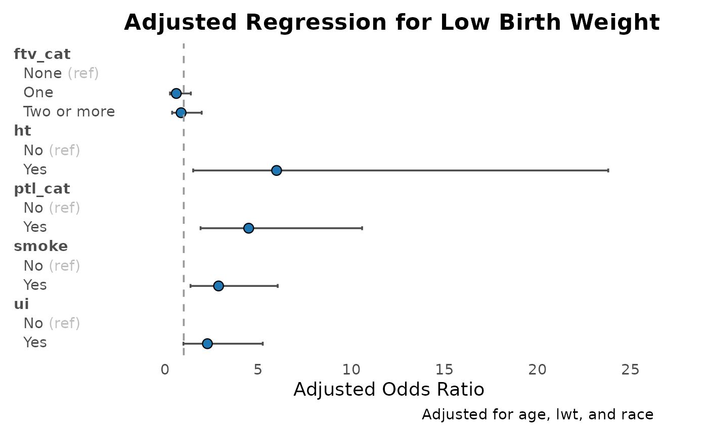
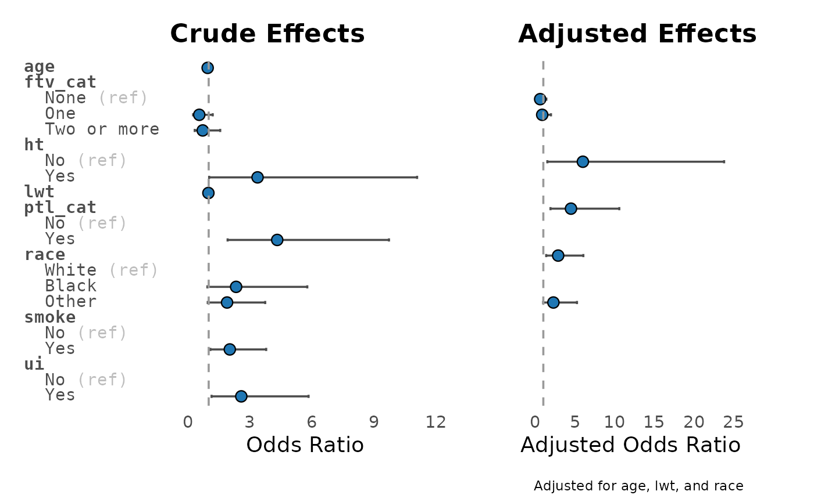
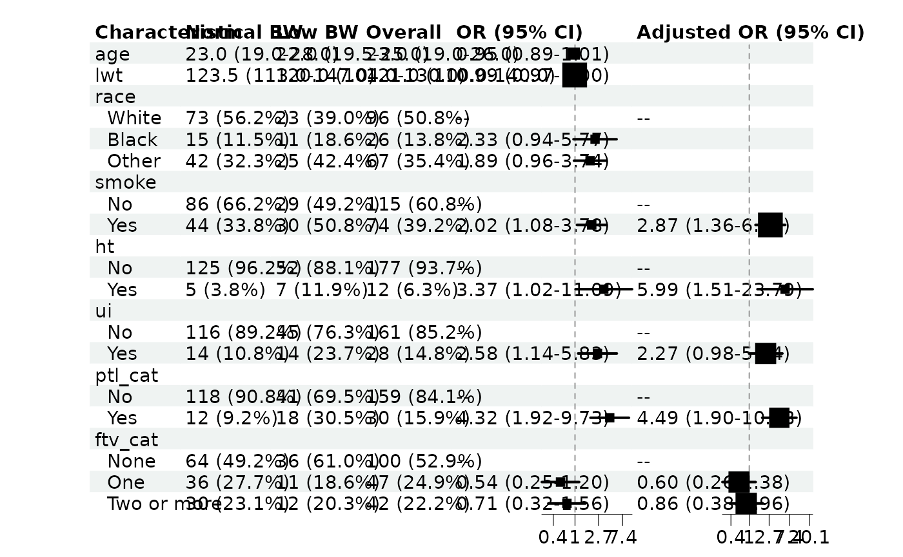

# Visualise Regression Results

## Visualise Regression Results

Regression tables are the evidence. Plots are the vibe check. Use
[`plot_reg()`](https://thinkdenominator.github.io/gtregression/reference/plot_reg.md),
[`plot_reg_combine()`](https://thinkdenominator.github.io/gtregression/reference/plot_reg_combine.md),
[`forest_df()`](https://thinkdenominator.github.io/gtregression/reference/forest_df.md),
and
[`forest_reg()`](https://thinkdenominator.github.io/gtregression/reference/forest_reg.md)
to make the results easier to scan.

``` r

library(gtregression)
library(dplyr)

data("data_birthwt", package = "gtregression")

birthwt_data <- data_birthwt |>
  mutate(
    race = factor(race, levels = c(1, 2, 3),
                  labels = c("White", "Black", "Other")),
    smoke = factor(smoke, levels = c(0, 1), labels = c("No", "Yes")),
    ht = factor(ht, levels = c(0, 1), labels = c("No", "Yes")),
    ui = factor(ui, levels = c(0, 1), labels = c("No", "Yes")),
    low = factor(low, levels = c(0, 1), labels = c("Normal BW", "Low BW")),
    ptl_cat = factor(ifelse(ptl > 0, "Yes", "No"), levels = c("No", "Yes")),
    ftv_cat = factor(case_when(
      ftv == 0 ~ "None",
      ftv == 1 ~ "One",
      ftv >= 2 ~ "Two or more"
    ), levels = c("None", "One", "Two or more"))
  )

birthwt_exposures <- c(
  "age", "lwt", "race", "smoke", "ht", "ui", "ptl_cat", "ftv_cat"
)

birthwt_desc <- descriptive_table(
  birthwt_data,
  exposures = birthwt_exposures,
  by = "low",
  show_overall = last
)
birthwt_uni <- uni_reg(
  birthwt_data,
  outcome = "low",
  exposures = birthwt_exposures,
  approach = logit
)
birthwt_multi <- multi_reg(
  birthwt_data,
  outcome = "low",
  exposures = c("smoke", "ht", "ui", "ptl_cat", "ftv_cat"),
  adjust_for = c("age", "lwt", "race"),
  approach = logit
)
```

### One Regression Plot

``` r

plot_reg(
  birthwt_multi,
  title = "Adjusted Regression for Low Birth Weight"
)
```



### Compare Crude and Adjusted Effects

``` r

plot_reg_combine(
  tbl_uni = birthwt_uni,
  tbl_multi = birthwt_multi,
  title_uni = "Crude Effects",
  title_multi = "Adjusted Effects"
)
```



### Publication-Style Forest Table

[`forest_df()`](https://thinkdenominator.github.io/gtregression/reference/forest_df.md)
prepares the data.
[`forest_reg()`](https://thinkdenominator.github.io/gtregression/reference/forest_reg.md)
draws the forest table.

``` r

forest_data <- forest_df(
  uni = birthwt_uni,
  multi = birthwt_multi,
  desc = birthwt_desc
)

forest_reg(forest_data, quiet = TRUE)
```



### What To Inspect

- [`plot_reg()`](https://thinkdenominator.github.io/gtregression/reference/plot_reg.md)
  returns a `ggplot`.
- [`plot_reg_combine()`](https://thinkdenominator.github.io/gtregression/reference/plot_reg_combine.md)
  returns a combined `ggplot`.
- [`forest_df()`](https://thinkdenominator.github.io/gtregression/reference/forest_df.md)
  returns the plotting data frame.
- [`forest_reg()`](https://thinkdenominator.github.io/gtregression/reference/forest_reg.md)
  returns `plot`, `data`, `input_data`, and `meta`.
