# Visualise Regression Results

Regression tables are the evidence. Plots are the quick read. Use
[`km_plot()`](https://thinkdenominator.github.io/gtregression/reference/km_plot.md),
[`km_risk_table()`](https://thinkdenominator.github.io/gtregression/reference/km_risk_table.md),
[`rmst_table()`](https://thinkdenominator.github.io/gtregression/reference/rmst_table.md),
[`survival_summary()`](https://thinkdenominator.github.io/gtregression/reference/survival_summary.md),
[`survival_quantiles()`](https://thinkdenominator.github.io/gtregression/reference/survival_quantiles.md),
[`survival_prob()`](https://thinkdenominator.github.io/gtregression/reference/survival_prob.md),
[`logrank_test()`](https://thinkdenominator.github.io/gtregression/reference/logrank_test.md),
[`surv_model_compare()`](https://thinkdenominator.github.io/gtregression/reference/surv_model_compare.md),
[`plot_surv_fit()`](https://thinkdenominator.github.io/gtregression/reference/plot_surv_fit.md),
[`surv_predict()`](https://thinkdenominator.github.io/gtregression/reference/surv_predict.md),
[`plot_reg()`](https://thinkdenominator.github.io/gtregression/reference/plot_reg.md),
[`plot_reg_combine()`](https://thinkdenominator.github.io/gtregression/reference/plot_reg_combine.md),
[`forest_df()`](https://thinkdenominator.github.io/gtregression/reference/forest_df.md),
and
[`forest_reg()`](https://thinkdenominator.github.io/gtregression/reference/forest_reg.md)
to visualise survival and regression results, inspect reference
categories, and prepare figures for manuscripts or reports.

``` r

library(gtregression)
library(dplyr)

data("data_birthwt", package = "gtregression")
data("data_lungcancer", package = "gtregression")

birthwt_data <- data_birthwt |>
  mutate(
    race = factor(race, levels = c(1, 2, 3),
                  labels = c("White", "Black", "Other")),
    smoke = factor(smoke, levels = c(0, 1), labels = c("No", "Yes")),
    ht = factor(ht, levels = c(0, 1), labels = c("No", "Yes")),
    ui = factor(ui, levels = c(0, 1), labels = c("No", "Yes")),
    low = factor(low, levels = c(0, 1), labels = c("Normal BW", "Low BW")),
    ptl_cat = factor(ifelse(ptl > 0, "Yes", "No"), levels = c("No", "Yes")),
    ftv_cat = factor(case_when(
      ftv == 0 ~ "None",
      ftv == 1 ~ "One",
      ftv >= 2 ~ "Two or more"
    ), levels = c("None", "One", "Two or more"))
  )

birthwt_exposures <- c(
  "age", "lwt", "race", "smoke", "ht", "ui", "ptl_cat", "ftv_cat"
)

attr(birthwt_data$age, "label") <- "Maternal age"
attr(birthwt_data$lwt, "label") <- "Maternal weight"
attr(birthwt_data$race, "label") <- "Maternal race"
attr(birthwt_data$smoke, "label") <- "Smoking during pregnancy"
attr(birthwt_data$ht, "label") <- "Hypertension"
attr(birthwt_data$ui, "label") <- "Uterine irritability"
attr(birthwt_data$ptl_cat, "label") <- "Previous preterm labour"
attr(birthwt_data$ftv_cat, "label") <- "First trimester visits"

birthwt_desc <- descriptive_table(
  birthwt_data,
  exposures = birthwt_exposures,
  by = "low",
  show_overall = "last"
)
birthwt_uni <- uni_reg(
  birthwt_data,
  outcome = "low",
  exposures = birthwt_exposures,
  approach = "logit"
)
birthwt_multi <- multi_reg(
  birthwt_data,
  outcome = "low",
  exposures = c("smoke", "ht", "ui", "ptl_cat", "ftv_cat"),
  adjust_for = c("age", "lwt", "race"),
  approach = "logit"
)

lung_data <- data_lungcancer |>
  mutate(
    trt = factor(trt, levels = c(1, 2),
                 labels = c("Standard treatment", "Test treatment"))
  )

lung_surv <- surv_reg(
  data = lung_data,
  time = time,
  event = status,
  exposures = "trt",
  adjust_for = c("age", "karno"),
  distribution = weibull
)
```

## Kaplan-Meier Curve

[`km_plot()`](https://thinkdenominator.github.io/gtregression/reference/km_plot.md)
gives the survival curve before regression modelling. Use it to show the
observed survival experience by group, with optional confidence
intervals, censoring marks, log-rank p-value, and number-at-risk table.

``` r

km_plot(
  data = lung_data,
  time = time,
  event = status,
  by = trt,
  break_time_by = 200,
  title = "Kaplan-Meier Survival by Treatment"
)
```

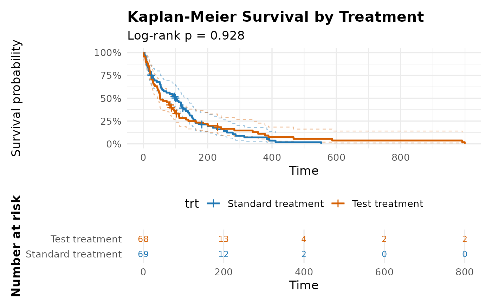

## Risk Table

[`km_risk_table()`](https://thinkdenominator.github.io/gtregression/reference/km_risk_table.md)
gives the number at risk at selected follow-up times as a standalone
table. This is useful when the risk table needs to be reported beside or
underneath a Kaplan-Meier curve.

``` r

km_risk_table(
  data = lung_data,
  time = time,
  event = status,
  by = trt,
  times = c(0, 90, 180, 365)
)
```

## Restricted Mean Survival Time

[`rmst_table()`](https://thinkdenominator.github.io/gtregression/reference/rmst_table.md)
reports the average survival time up to a fixed follow-up point, called
`tau`. This is useful when readers want an absolute survival-time
summary, or when hazard ratios are difficult to explain.

``` r

rmst_table(
  data = lung_data,
  time = time,
  event = status,
  by = trt,
  tau = 365
)
```

## Kaplan-Meier Summary

[`survival_summary()`](https://thinkdenominator.github.io/gtregression/reference/survival_summary.md)
is the table companion to the Kaplan-Meier curve. It reports the number
analysed, events, censored observations, and median survival with a 95%
confidence interval. Use it when readers need the key survival numbers
without reading them from the plot.

``` r

survival_summary(
  data = lung_data,
  time = time,
  event = status,
  by = trt
)
```

## Survival Quantiles

[`survival_quantiles()`](https://thinkdenominator.github.io/gtregression/reference/survival_quantiles.md)
reports detailed Kaplan-Meier time points. This is useful when the
median alone is not enough, or when you want to show the 25th, 50th, and
75th percentile event times by group.

``` r

survival_quantiles(
  data = lung_data,
  time = time,
  event = status,
  by = trt
)
```

## Survival Probabilities

[`survival_prob()`](https://thinkdenominator.github.io/gtregression/reference/survival_prob.md)
reports Kaplan-Meier survival probability at fixed follow-up times. This
is useful for clinically familiar summaries such as 90-day, 6-month, or
1-year survival.

``` r

survival_prob(
  data = lung_data,
  time = time,
  event = status,
  by = trt,
  times = c(90, 180, 365)
)
```

## Log-Rank Test

[`logrank_test()`](https://thinkdenominator.github.io/gtregression/reference/logrank_test.md)
formally compares Kaplan-Meier curves between groups. It is useful after
the curve and summary table, but it does not give an effect size; use
[`cox_reg()`](https://thinkdenominator.github.io/gtregression/reference/cox_reg.md)
when a hazard ratio is needed.

``` r

logrank_test(
  data = lung_data,
  time = time,
  event = status,
  by = trt
)
```

## Parametric Survival Model Comparison

[`surv_model_compare()`](https://thinkdenominator.github.io/gtregression/reference/surv_model_compare.md)
helps users choose a candidate distribution before using
[`surv_reg()`](https://thinkdenominator.github.io/gtregression/reference/surv_reg.md).
It fits the same model with Weibull, exponential, lognormal, and
loglogistic distributions, then compares AIC and BIC.

``` r

surv_model_compare(
  data = lung_data,
  time = time,
  event = status,
  exposures = c("trt", "celltype"),
  adjust_for = c("age", "karno")
)
```

## Parametric Survival Fit Plot

[`plot_surv_fit()`](https://thinkdenominator.github.io/gtregression/reference/plot_surv_fit.md)
is the visual companion to
[`surv_model_compare()`](https://thinkdenominator.github.io/gtregression/reference/surv_model_compare.md).
It overlays the observed Kaplan-Meier curve with fitted parametric
survival curves, so users can check whether a distribution that looks
good by AIC/BIC also follows the observed survival pattern.

``` r

plot_surv_fit(
  data = lung_data,
  time = time,
  event = status,
  by = trt,
  distributions = c(weibull, lognormal),
  break_time_by = 200
)
```

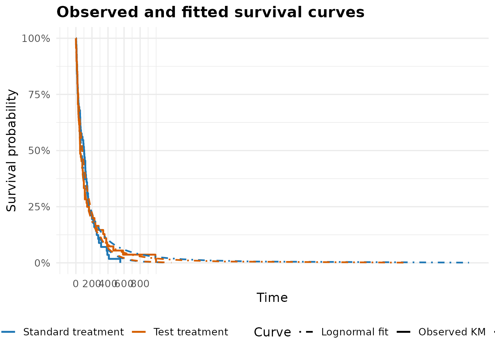

Adjusted fitted curves can also be drawn. In that case, the curves are
predicted at typical adjustment values, such as medians for numeric
variables and the most common level for categorical variables.

``` r

plot_surv_fit(
  data = lung_data,
  time = time,
  event = status,
  by = trt,
  adjust_for = c(age, karno),
  distributions = loglogistic,
  xlim = c(0, 800)
)
```

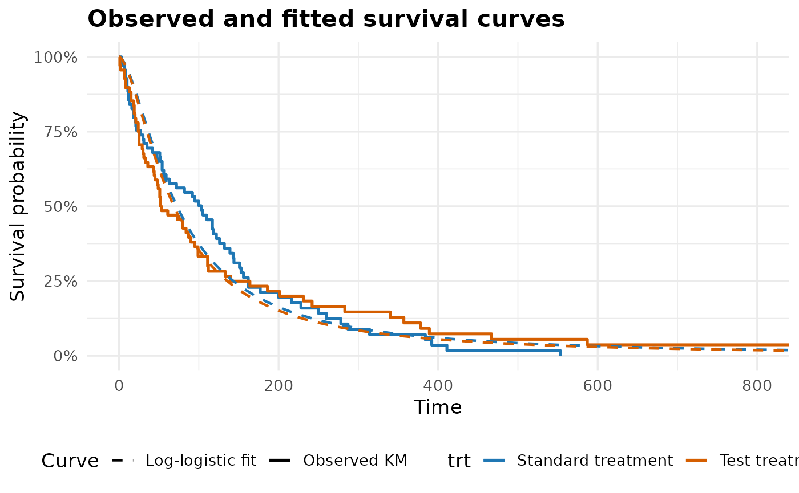

## Parametric Survival Prediction

[`surv_predict()`](https://thinkdenominator.github.io/gtregression/reference/surv_predict.md)
turns a fitted parametric survival model into predicted survival
probabilities at clinically useful follow-up times. This helps users
move from a time-ratio table to a more direct statement such as
predicted 90-day, 180-day, or 1-year survival for a profile.

``` r

surv_predict(
  model = lung_surv$models$trt,
  newdata = data.frame(
    trt = factor("Test treatment", levels = levels(lung_data$trt)),
    age = 60,
    karno = 70
  ),
  times = c(90, 180, 365)
)
```

If `newdata` is omitted,
[`surv_predict()`](https://thinkdenominator.github.io/gtregression/reference/surv_predict.md)
uses a typical profile from the model data, using medians for numeric
variables and the most common level for categorical variables.

## One Regression Plot

[`plot_reg()`](https://thinkdenominator.github.io/gtregression/reference/plot_reg.md)
turns a
[`uni_reg()`](https://thinkdenominator.github.io/gtregression/reference/uni_reg.md)
or
[`multi_reg()`](https://thinkdenominator.github.io/gtregression/reference/multi_reg.md)
result into a forest-style plot. By default, categorical reference
levels are shown and labelled as `(Ref.)`; the caption explains the
abbreviation. Variable labels set on the data are used automatically in
the plot.

``` r

plot_reg(
  birthwt_uni,
  title = "Crude Associations With Low Birth Weight"
)
```

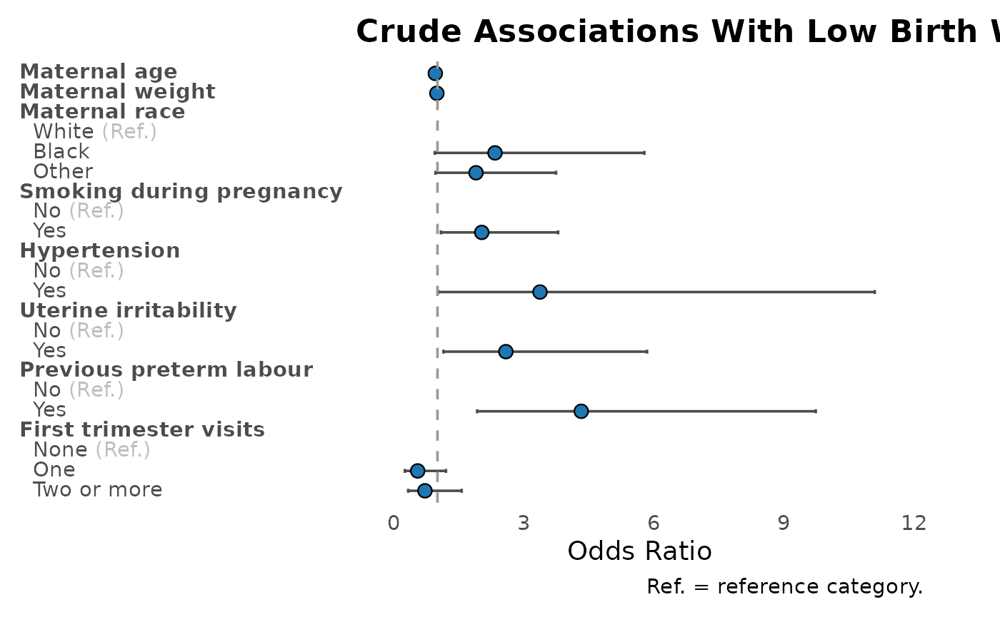

## Adjusted Regression Plot

When the input comes from `multi_reg(adjust_for = ...)`, the adjustment
set is shown in the plot caption by default. This keeps the figure
interpretable when it is copied into slides or a manuscript draft.

``` r

plot_reg(
  birthwt_multi,
  show_ref = FALSE,
  log_x = TRUE,
  title = "Adjusted Associations With Low Birth Weight"
)
```

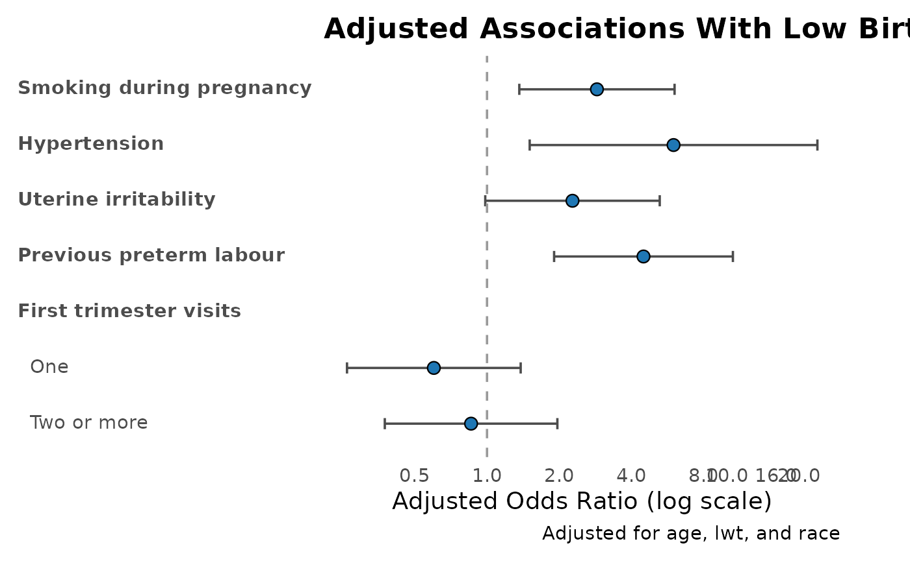

## Compact Binary Predictors

For Yes/No, 1/0, true/false, or similar binary predictors, set
`show_ref = FALSE` to hide reference rows. Affirmative binary levels
such as `Yes` are displayed as the exposure name itself, so the plot
remains compact: `smoke`, `ht`, `ui`, and `ptl_cat` are easier to read
than repeated `variable: Yes` labels.

``` r

plot_reg(
  birthwt_uni,
  show_ref = FALSE,
  title = "Crude Associations With Reference Rows Hidden"
)
```

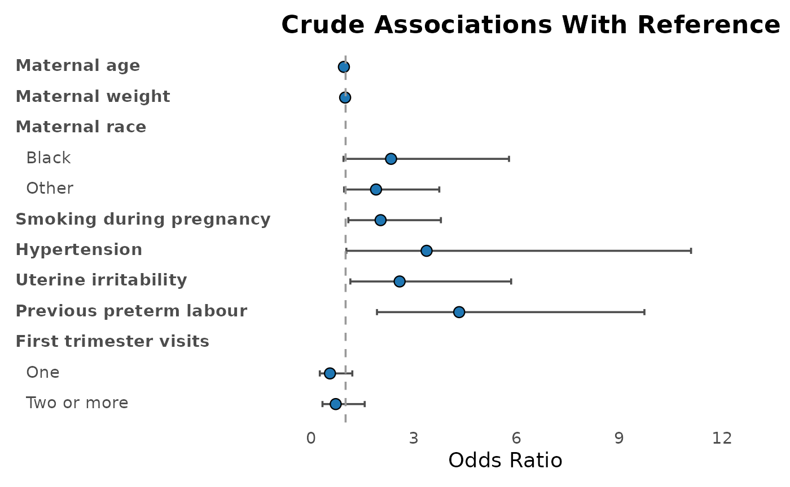

## Log Axis and Tick Marks

For ratio measures such as odds ratios, risk ratios, and incidence rate
ratios, `log_x = TRUE` uses a log-scaled x-axis. If you do not provide
tick marks, `gtregression` chooses sensible defaults around the null
value of 1.

``` r

plot_reg(
  birthwt_uni,
  log_x = TRUE,
  title = "Crude Associations on a Log Scale"
)
```

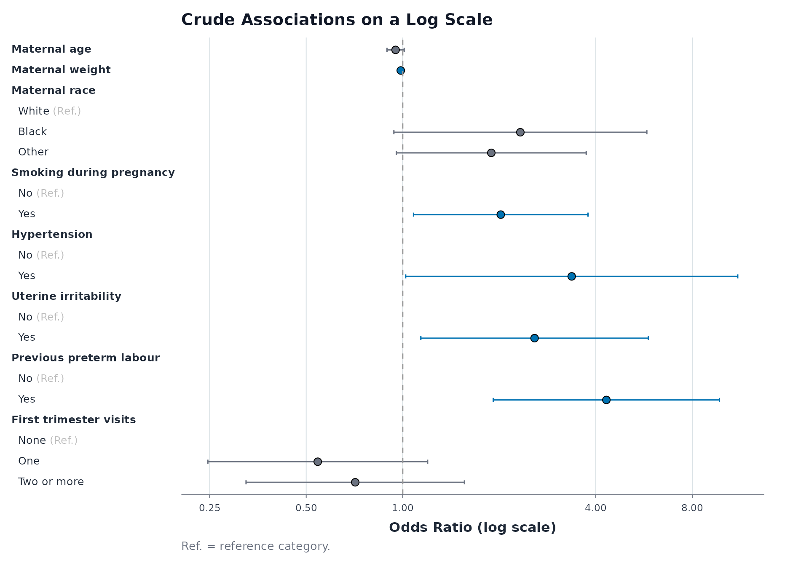

You can still take full control of the visible axis range and tick
marks.

``` r

plot_reg(
  birthwt_uni,
  show_ref = FALSE,
  log_x = TRUE,
  xlim = c(0.25, 12),
  breaks = c(0.5, 1, 2, 4, 8),
  title = "Crude Associations With Custom Axis"
)
```

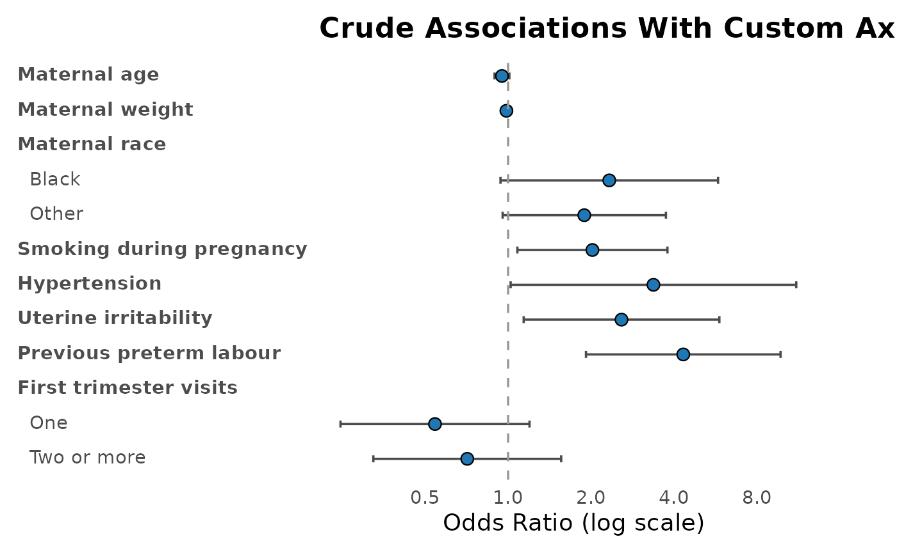

## Compare Crude and Adjusted Effects

[`plot_reg_combine()`](https://thinkdenominator.github.io/gtregression/reference/plot_reg_combine.md)
places crude and adjusted model results side by side. This is useful
when a manuscript needs to show how adjustment changes the estimate.
Axis limits and tick marks can be controlled separately for each side.

``` r

plot_reg_combine(
  tbl_uni = birthwt_uni,
  tbl_multi = birthwt_multi,
  show_ref = FALSE,
  log_x = TRUE,
  xlim_uni = c(0.25, 12),
  breaks_uni = c(0.5, 1, 2, 4, 8),
  xlim_multi = c(0.25, 16),
  breaks_multi = c(0.5, 1, 2, 4, 8),
  title_uni = "Crude Effects",
  title_multi = "Adjusted Effects"
)
```

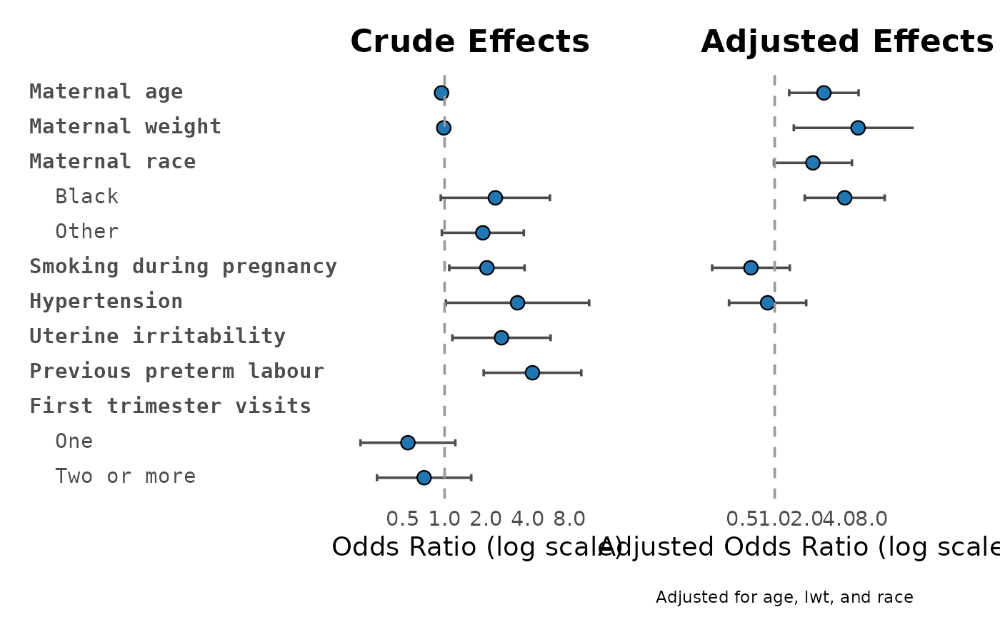

## Publication-Style Forest Table

[`forest_df()`](https://thinkdenominator.github.io/gtregression/reference/forest_df.md)
prepares the data.
[`forest_reg()`](https://thinkdenominator.github.io/gtregression/reference/forest_reg.md)
draws the forest table. This is the most manuscript-oriented plot when
you want descriptive summaries and crude or adjusted estimates in the
same figure.

``` r

forest_data <- forest_df(
  uni = birthwt_uni,
  multi = birthwt_multi,
  desc = birthwt_desc
)

forest_reg(forest_data, quiet = TRUE)
```

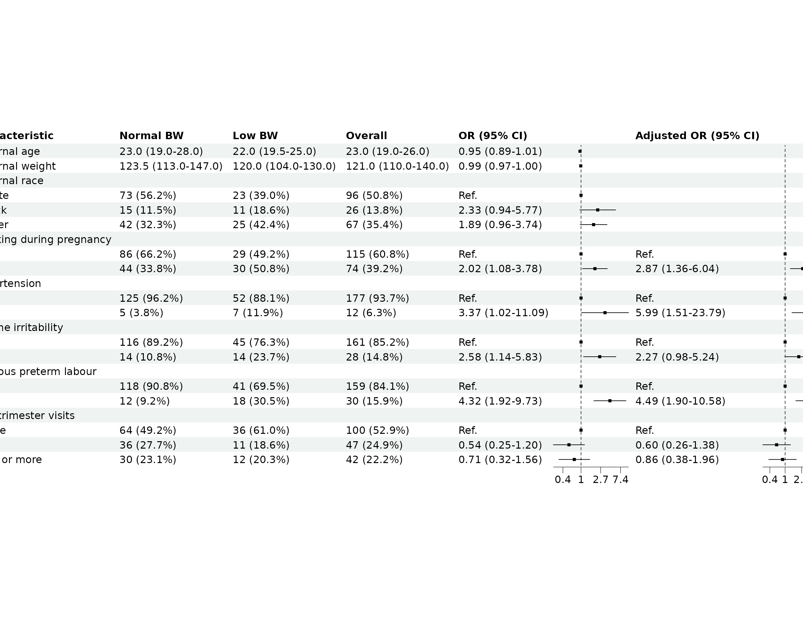

### Fine-Tune Forest Tables

Wide forest tables combine descriptive summaries, crude estimates,
adjusted estimates, and one or two forest plot panels. If the x-axis
labels are crowded, control the axis range and tick marks with `xlim`
and `ticks_at`.

Use a list when the table has crude and adjusted forest plot columns.

``` r

forest_reg(
  forest_data,
  xlim = list(c(0.25, 8), c(0.8, 25)),
  ticks_at = list(
    c(0.5, 1, 2, 4, 8),
    c(1, 2, 4, 8, 16)
  ),
  quiet = TRUE
)
```

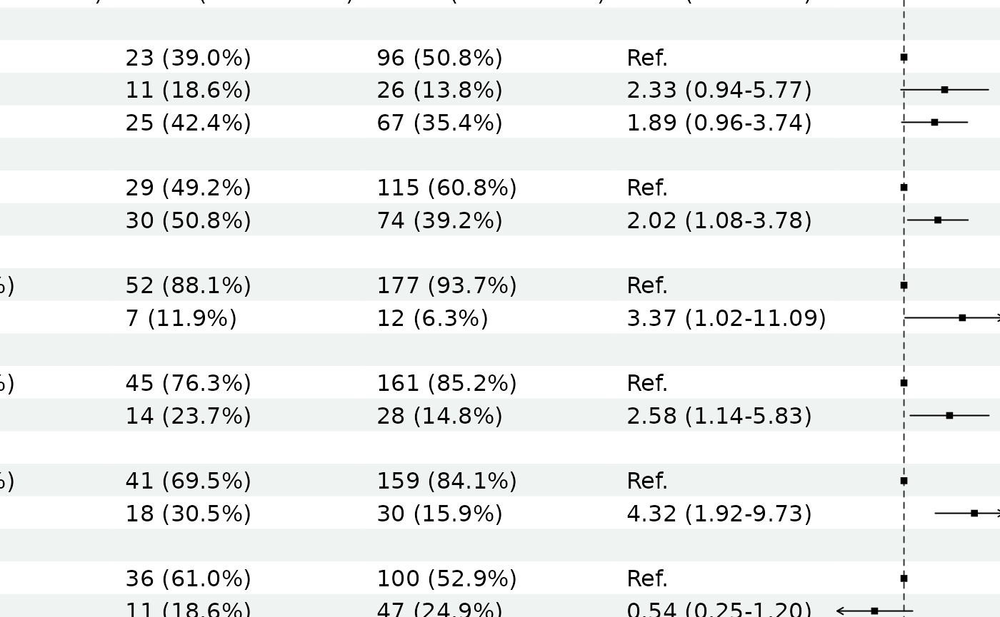

If the plot panel itself looks too narrow or too wide, tune
`ci_col_width`. This changes the blank spacer column that `forestploter`
uses for drawing the confidence intervals. Larger values give the CI
panel more room; smaller values make the overall table more compact.

``` r

forest_reg(
  forest_data,
  ci_col_width = c(18, 22),
  xlim = list(c(0.25, 8), c(0.8, 25)),
  ticks_at = list(
    c(0.5, 1, 2, 4, 8),
    c(1, 2, 4, 8, 16)
  ),
  quiet = TRUE
)
```

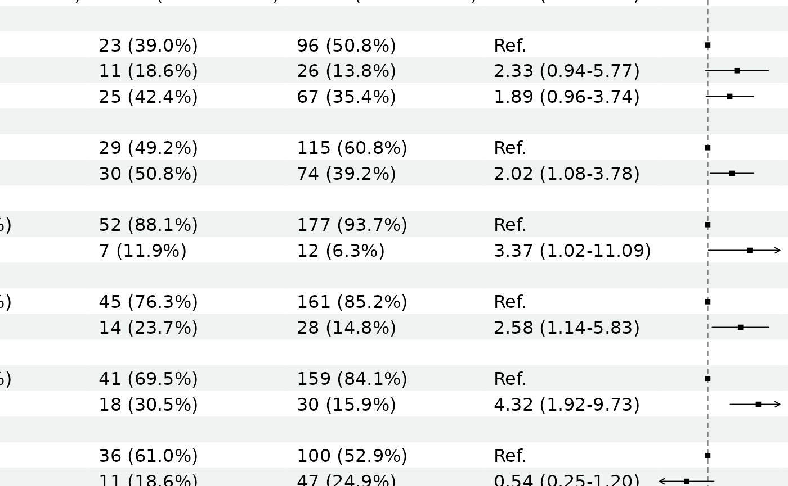

For publication export, use a wider graphics device or document canvas
when the table includes several descriptive columns and two model
columns.

You can also build and draw in one call.

``` r

forest_reg(
  uni = birthwt_uni,
  multi = birthwt_multi,
  desc = birthwt_desc,
  side = "left",
  quiet = TRUE
)
```

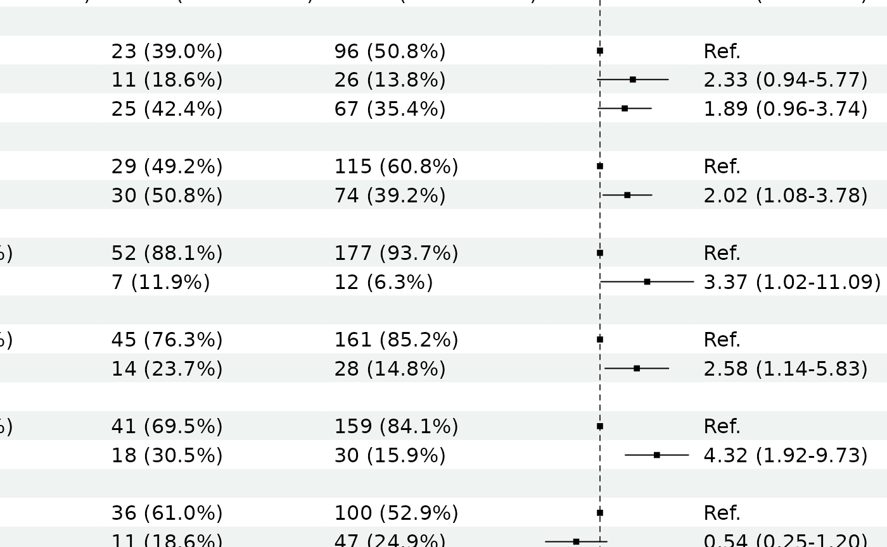

## What To Inspect

- [`plot_reg()`](https://thinkdenominator.github.io/gtregression/reference/plot_reg.md)
  returns a `ggplot`.
- [`plot_reg_combine()`](https://thinkdenominator.github.io/gtregression/reference/plot_reg_combine.md)
  returns a combined `ggplot`.
- [`km_risk_table()`](https://thinkdenominator.github.io/gtregression/reference/km_risk_table.md)
  reports at-risk, event, and censored counts at requested follow-up
  times.
- [`rmst_table()`](https://thinkdenominator.github.io/gtregression/reference/rmst_table.md)
  reports restricted mean survival time up to a chosen time point.
- `show_ref = TRUE` displays reference levels as `(Ref.)`.
- `show_ref = FALSE` hides reference levels; affirmative binary
  predictors are shown as compact bold exposure rows.
- Adjustment variables from `multi_reg(adjust_for = ...)` are carried
  into plot captions.
- `log_x = TRUE` uses log scaling for non-linear model effect measures.
- [`forest_df()`](https://thinkdenominator.github.io/gtregression/reference/forest_df.md)
  returns the plotting data frame.
- [`survival_prob()`](https://thinkdenominator.github.io/gtregression/reference/survival_prob.md)
  reports survival probability at requested follow-up times.
- [`surv_model_compare()`](https://thinkdenominator.github.io/gtregression/reference/surv_model_compare.md)
  compares parametric survival distributions before fitting final
  [`surv_reg()`](https://thinkdenominator.github.io/gtregression/reference/surv_reg.md)
  tables.
- [`plot_surv_fit()`](https://thinkdenominator.github.io/gtregression/reference/plot_surv_fit.md)
  overlays fitted parametric survival curves on the observed
  Kaplan-Meier curve.
- [`surv_predict()`](https://thinkdenominator.github.io/gtregression/reference/surv_predict.md)
  reports model-based survival probabilities at user-specified follow-up
  times.
- In
  [`forest_reg()`](https://thinkdenominator.github.io/gtregression/reference/forest_reg.md),
  use `xlim` and `ticks_at` when x-axis labels overlap.
- In
  [`forest_reg()`](https://thinkdenominator.github.io/gtregression/reference/forest_reg.md),
  use `ci_col_width` when the CI plot panel is too narrow or too wide.
- [`forest_reg()`](https://thinkdenominator.github.io/gtregression/reference/forest_reg.md)
  returns `plot`, `data`, `input_data`, and `meta`.
